
 This is a summary of all the report, for the full version please visit de <a href="https://github.com/carlosCharlie/BachelorThesis-ShuttleBus/wiki/SuhttleGo-full-report">wiki</a>

(Generated from the original docx file)

<h1 align="center">Aplicación para la gestión de shuttle buses</h1>

<h2 align="center">Trabajo de Fin de Grado</h2>

  

<h2 align="center">Trabajo de fin de grado del Grado en Ingeniería de Software.</h2>
<h2 align="center"> Facultad de informática, Universidad Complutense de Madrid.</h2>
<h2 align="center"> 2018-2019</h2>
Carlos Castellanos Mateo  
Víctor Chamizo Rodríguez
    
Director:

Antonio Sarasa Cabezuelo

## 

## 

## 

## 

## 

## 

## 

# Resumen

La gran mayoría de los trayectos que se generan hacia y desde los
aeropuertos europeos se realizan en vehículos privados, lo que provoca
altos niveles de congestión en la red viaria que une el aeropuerto con
la región de influencia. Para muchas ciudades garantizar el acceso
eficiente y a bajo precio a los aeropuertos se ha convertido en un
aspecto fundamental en sus planes de movilidad, lo que les ha llevado a
fomentar ciertos tipos de transporte que no eran mayoritarios en esta
clase de trayectos.

El shuttle bus se encuentra dentro de estas iniciativas y está ganando
protagonismo durante los últimos años, dando lugar a que cada vez más
empresas ofrezcan este medio de transporte como la mejor alternativa
para los trayectos desde y hacia los aeropuertos.

Este Trabajo de Fin de Grado tiene como objetivo presentar una
aplicación móvil que solucione el problema de contratación con el que
se encuentran los usuarios a la hora de acceder a este tipo de
servicios, aportando portabilidad, sencillez y rapidez, que son las
cualidades de las que carecen actualmente los principales portales de
contratación de shuttle bus. La aplicación está destinada tanto a los
pasajeros que quieren contratar el servicio como a los conductores que
quieren ofrecerlo. Aunque comenzó como una idea para solucionar el
problema del transporte hacia o desde los aeropuertos a determinados
puntos del mapa, la realidad es que es una aplicación escalable y que se
puede aplicar para resolver otros problemas de transporte ajenos a los
aeropuertos y en cualquier parte del planeta.

Palabras clave: autobús, transporte, servicio, shuttle, conductor,
pasajero, ruta, aeropuerto.

# Abstract

Most of the traffic between european airports and hotels is generated by
private vehicles, this uses to cause big road congestion problems
between these two. Guaranteeing a low cost and efficient access to the
airports is one of the most important mobility plan objectives of the
cities, so some minority transport methods are being promoted.

Shuttle bus is one of these new initiatives which is getting popular
during the last years, making companies offer this new type of service
as an alternative for moving between airports and other points.

The goal of this end-of-degree project is showing a smartphone
application that solve the booking problem found when users try to
access these services, giving portability, simplicity and quickness to
the experience, properties that can not be found in other shuttle bus
apps. This app is made for both passengers who want to contract a
service and drivers who want to offer theirs. Although the project
started as an idea only for airports, it’s scalable and can be used to
solve other types of problems around the world.

Keywords: bus, transport, service, shuttle, driver, passenger, route,
airport.
# Manual de usuario

Este manual proporciona los detalles necesarios para el uso de la
aplicación móvil ShuttleGo, con la finalidad de brindar al usuario una
herramienta que asegure el uso correcto de la aplicación.

En la aplicación se pueden adoptar varios roles, por lo que se explicará
en secciones separadas cada una de las funcionalidades de dichos roles y
cómo poder acceder a cada uno de ellos.

#### Inicio de sesión.

> La primera interfaz que se muestra para interactuar con la aplicación
> es la de inicio de sesión. En dicha interfaz cabe la posibilidad de
> introducir las credenciales en los campos *email* y *contraseña* que
> aparecen en el centro de la pantalla o bien pulsar sobre el botón
> *regístrate* que está situado debajo del botón *iniciar sesión*
> (Figura AP-6).
> 
> 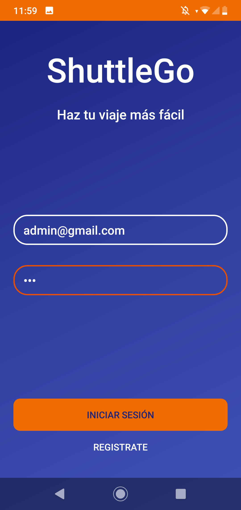

Figura AP-6. Inicio de sesión

> Si se elige la primera opción, el requisito previo es que el usuario
> ya posea una cuenta de usuario, de ser así, se introduce el email y
> contraseña en sus respectivos editores de texto y se pulsa sobre el
> botón *iniciar sesión*; si las credenciales han sido introducidas
> correctamente, se accede de forma directa a la aplicación, en caso
> contrario, se mostrará un mensaje de error tras el cual, se deben
> modificar los datos introducidos anteriormente hasta que sean
> correctos.
> 
> Si aún no se dispone de una cuenta de usuario se debe pulsar sobre el
> botón *regístrate,* que automáticamente redirigirá al registro de la
> aplicación.

#### Registro.

> El registro de la aplicación consta de dos fases, en cada una de las
> cuales se introduce un tipo de información diferente para poder
> finalizar el registro con éxito. En la primera fase (Figura AP-7) se
> especifican el correo, la contraseña y el rol que adoptará el usuario.
> Una vez que los campos están completados, se continúa pulsando sobre
> el botón *siguiente*. La segunda y última fase (Figura AP-8), es la
> referente a los datos personales, en la que únicamente se debe
> introducir el nombre, apellido/s y el número de teléfono del usuario.

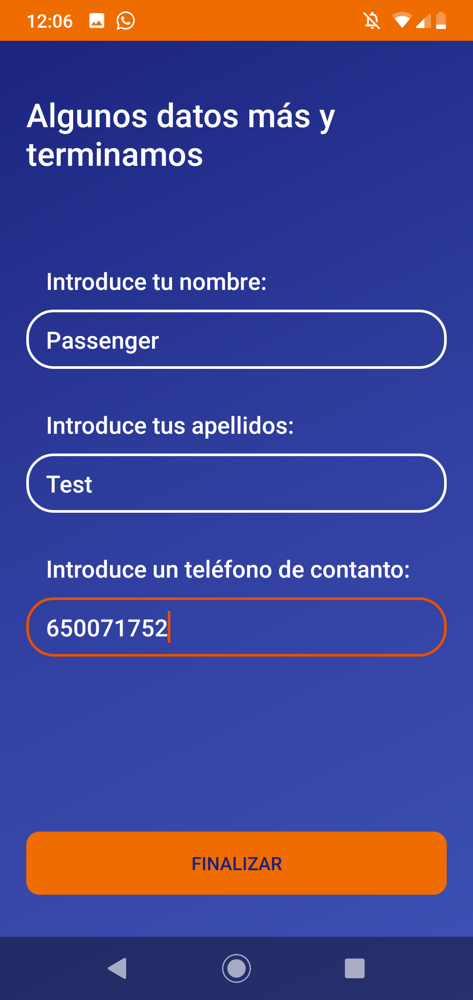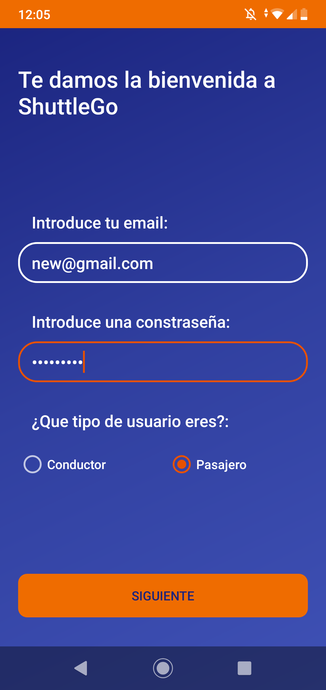

Figura AP-7. Registro 1 Figura AP-8. Registro 2

> Una vez realizados los pasos anteriores se puede concluir el proceso
> de registro pulsando sobre el botón *finalizar* que aparece en la
> parte inferior de la interfaz. Si los datos introducidos son
> correctos, se accede de forma directa a la aplicación, en caso
> contrario se mostrará un mensaje de error especificando el problema,
> tras el que se deben modificar los datos que sean erróneos y proceder
> a la verificación del registro nuevamente.

3.  #### Roles
    
    1.  ##### Administrador.

El rol de administrador adopta un papel fundamental dentro de la
aplicación, ya que es el encargado de establecer los puntos de origen
desde los cuales los conductores y pasajeros elegirán comenzar su
trayecto.

El rol de administrador no está disponible para el usuario de la
aplicación, por esta razón, es una opción que no aparece en el registro.
Para acceder desde el inicio de sesión a este módulo de la aplicación,
se deben introducir unas credenciales previamente establecidas:

  - Email de usuario: *<admin@gmail.com>*

  - Contraseña: *123*

La interfaz principal del administrador consta de dos partes: la primera
contiene un mapa y una barra de búsqueda desde la que se introduce la
reseña del punto de origen que se desea establecer. La segunda parte de
la interfaz está compuesta por un editor de texto en el que se introduce
el nombre que se quiere dar al origen (Figura AP-9).

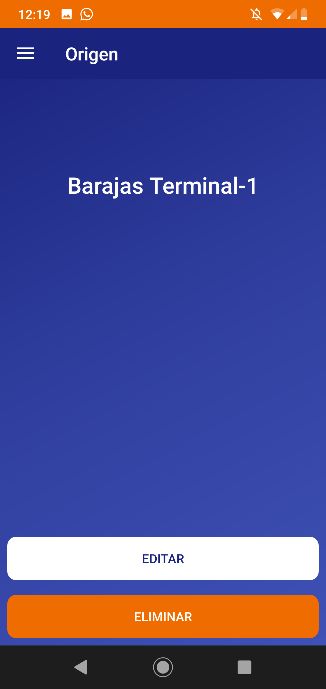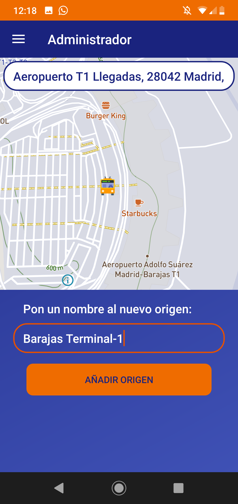

Figura AP-9 . Interfaz administrador Figura AP-10. Interfaz origen

Una vez realizados los pasos anteriores se puede finalizar el proceso
pulsando sobre el botón *añadir.* Si el origen ha sido añadido
correctamente se redirige a la interfaz principal del mismo (Figura
AP-10), en la que se pueden realizar dos operaciones: pulsar sobre el
botón *eliminar*, el cual borrará automáticamente el origen, o bien
pulsar sobre el botón *editar* que redirigirá a la interfaz de edición
del origen (Figura AP-11)*,* desde la cual se puede modificar su nombre
(Figura AP-12).

Es posible retornar a la interfaz principal haciendo uso del botón
*back* del dispositivo móvil (también desde cualquier interfaz del
módulo de administrador, así como del resto de la aplicación). Se puede
acceder al menú de opciones del módulo administrador de dos formas
diferentes: pulsando sobre el icono situado en la parte superior derecha
de la interfaz, o bien, deslizando el dedo desde la parte izquierda de
la pantalla hacia la parte derecha (Figura AP-13). Dicho menú consta de
dos opciones principales: el botón de *inicio*, el cual redirigirá a la
interfaz principal del módulo y el botón *orígenes,* que permite acceder
a un listado de todos los orígenes disponibles, con la posibilidad de
pulsar sobre cualquiera de ellos y acceder a las funcionalidades de
origen anteriormente descritas (Figura AP-14).

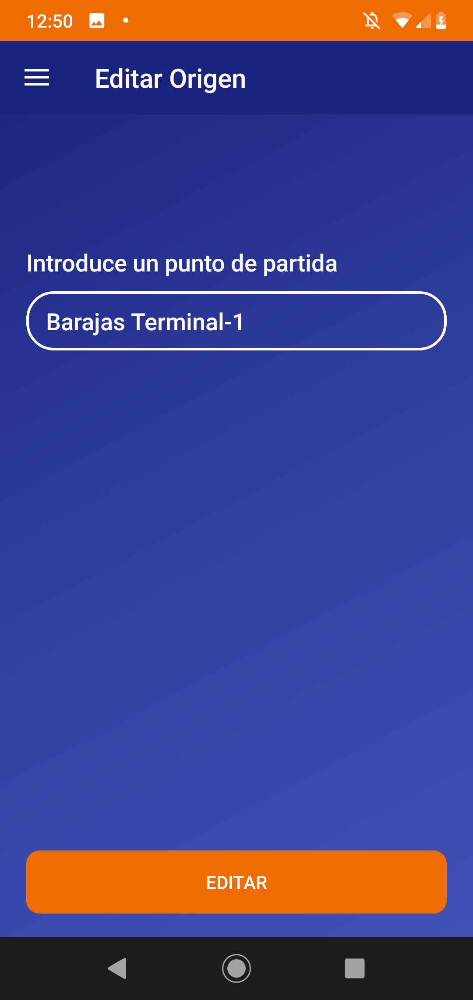

Figura AP-11 . Editar origen Figura AP-12. Origen editado

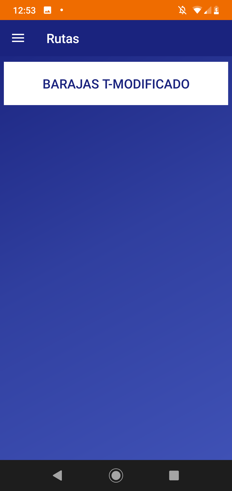

##### 

Figura AP-13 . Menú administrador Figura AP-14 . Listado de orígenes

##### Conductor.

El rol de conductor es el encargado de crear nuevos trayectos para que
los pasajeros puedan contratarlos.

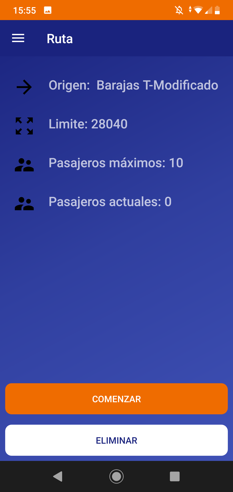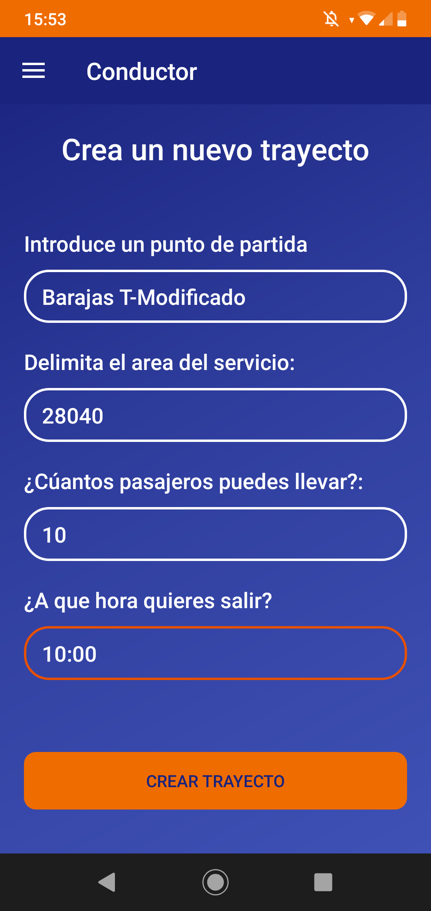

Figura AP-15 . Interfaz conductor Figura AP-16. Interfaz ruta conductor

La interfaz principal de conductor (Figura AP-15) consta de un
formulario en el que se deben introducir los datos correspondientes al
trayecto que se desea realizar. Dichos datos son: el punto de origen
preestablecido por el administrador, el código postal del distrito en el
cual se quiere dar servicio a los pasajeros, la capacidad de personas
máximas que puede llevar en el vehículo y la hora de salida desde el
punto de partida. Una vez introducidos todos los datos se puede
finalizar el proceso pulsando sobre el botón *crear trayecto*, tras lo
cual y siempre y cuando los datos introducidos sean correctos (de lo
contrario se notificará con un mensaje de aviso) se habrá concluido el
proceso de creación de un trayecto.

Cuando se crea un nuevo trayecto la aplicación redirige a la interfaz
principal del mismo (Figura AP-16) desde la cual se muestra la
información del trayecto así como las diferentes opciones que se pueden
realizar: un botón que permitirá *eliminar* el trayecto (siempre y
cuando dicho trayecto no contenga personas adjuntadas a él) y la opción
*comenzar trayecto*. Esta última opción solamente es accesible si el
número de pasajeros que ha contratado el trayecto es al menos uno. Si
se cumple el requisito anterior, y se pulsa sobre dicho botón, la
aplicación colocará los puntos por los que el conductor tendrá que
realizar el trayecto (Figura AP-17) y calculará la ruta más óptima para
llegar hasta ellos; tras este proceso se renderizará un mapa con la ruta
pintada sobre él (Figura AP-18) y nos dará la opción de *comenzar* el
trayecto.

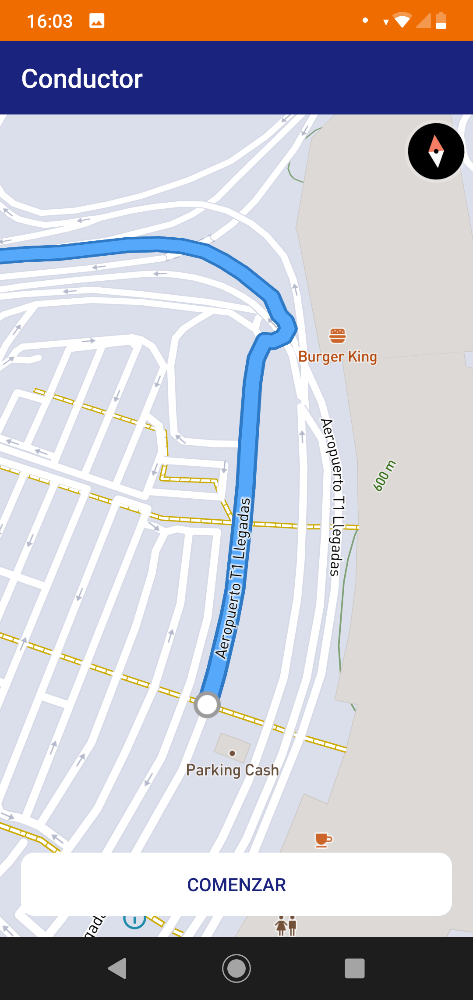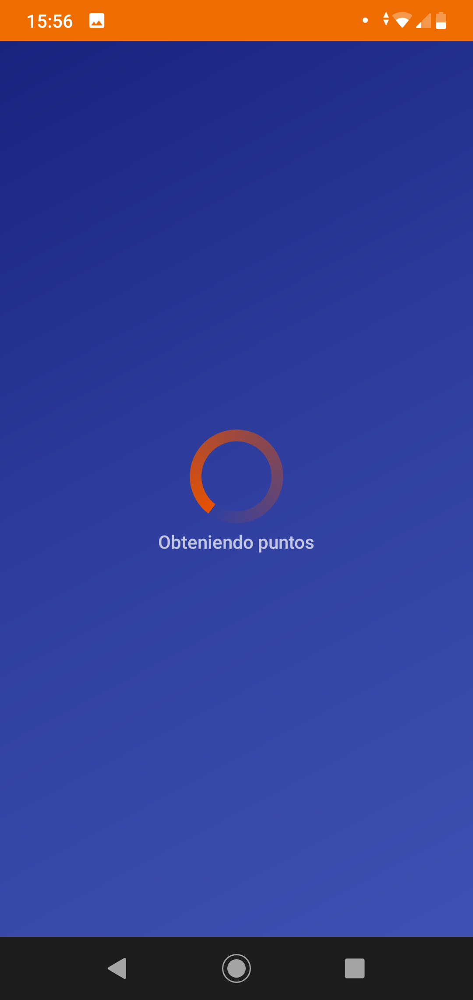

Figura AP-17. Calculando ruta Figura AP-18. Comenzar ruta

Al igual que en el resto de la aplicación es posible volver hacia atrás
pulsando los botones *back* del dispositivo móvil, permitiendo así
regresar a la interfaz principal. Se puede acceder al menú de opciones
(Figura AP-19) pulsando sobre el icono situado en la parte superior
derecha de la interfaz o bien deslizando el dedo sobre la pantalla desde
el lado izquierdo hacia el derecho. De esta forma se despliega el menú
dando lugar a varias opciones: el botón de *inicio*, que a la aplicación
en la interfaz principal del conductor y el botón *rutas* que permite
acceder a un listado (Figura AP-20) de los trayecto disponibles que
tiene el conductor en ese momento. En dicho listado es posible pulsar
sobre cualquiera de los trayectos accediendo de esta forma a las
diferentes opciones de ruta citadas anteriormente.

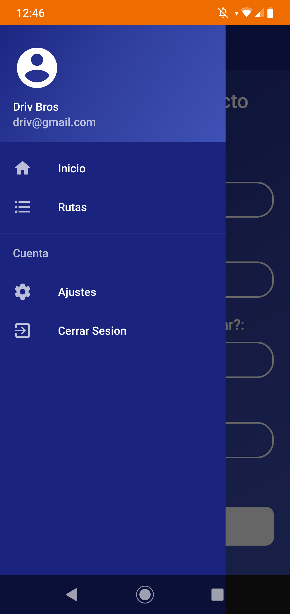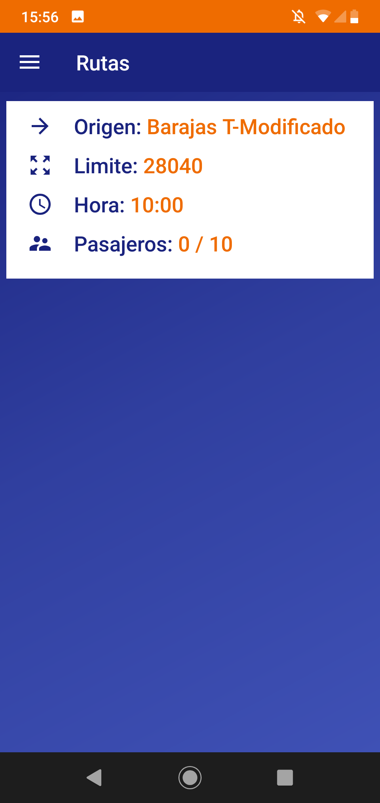

Figura AP-19. Menú conductor Figura AP-20. Listado rutas

##### Pasajero.

El rol de pasajero es el encargado de contratar los viajes publicados
por el conductor.

La interfaz principal de pasajero consiste en un mapa que muestra la
geolocalización del usuario y por el cual es posible navegar. En la
parte superior de dicho mapa, hay dos barras de búsqueda en las que el
pasajero debe introducir un punto de origen (ya preestablecido) y el
punto de destino al que desea dirigirse. Una vez completados ambos pasos
(Figura AP-21), se puede dar comienzo a la contratación del trayecto
pulsando sobre el botón *buscar trayecto*, tras lo cual se mostrará una
lista con las diferentes rutas disponibles según los datos anteriormente
introducidos (Figura AP-22).

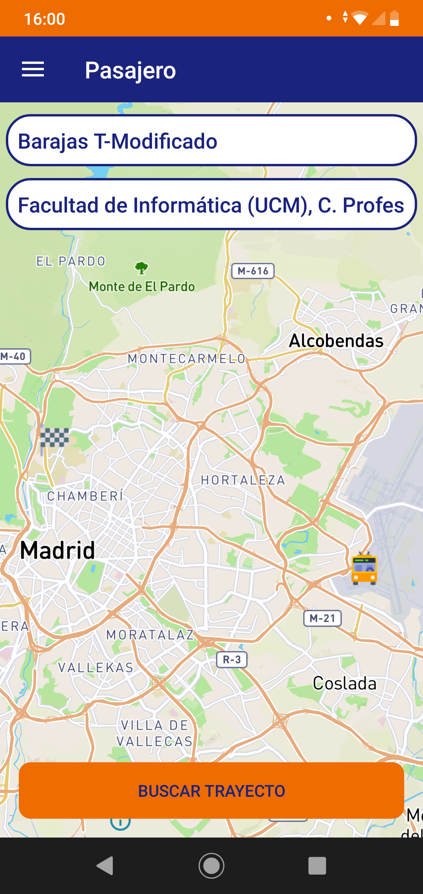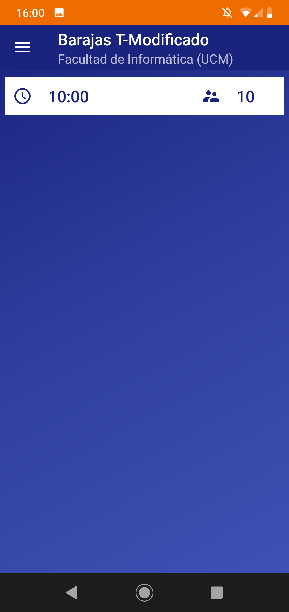

Figura AP-21. Interfaz pasajero Figura AP-22. Listado de viajes
disponibles

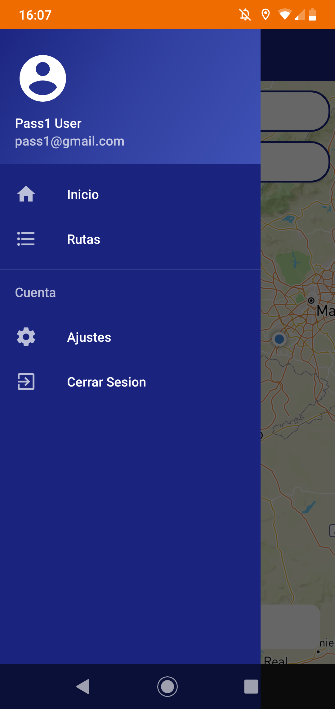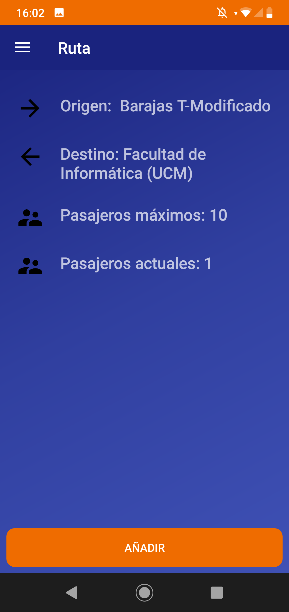

Figura AP-23. Información ruta Figura AP-24. Menú pasajero

Una vez que se ha elegido el trayecto deseado, se redirige a la interfaz
de trayecto en la que se muestran los detalles del mismo y se encuentra
la opción de contratar el viaje pulsando sobre el botón *añadir* (Figura
AP-23).

Se puede acceder al menú de opciones (Figura AP-24) pulsando sobre el
botón superior derecho de la interfaz o deslizando el dedo sobre la
pantalla desde la parte izquierda de la misma hacia la parte derecha. Si
se pulsa sobre el botón *inicio* se accede a la interfaz principal de
pasajero, en caso contrario, si la opción elegida es *rutas,* se accede
a un listado de las rutas contratadas por el pasajero (Figura AP-26). Al
pulsar sobre un trayecto de la lista, automáticamente se muestra la
información de dicho trayecto junto con la posibilidad de *cancelar
ruta* (Figura AP-26).

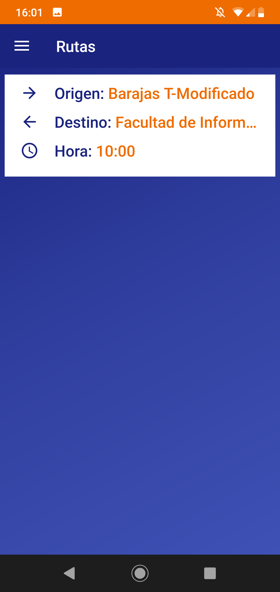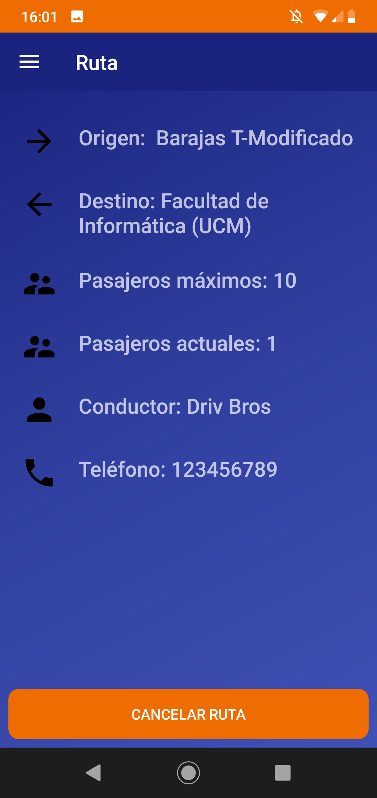

Figura AP-25.- Listado rutas pasajero Figura AP-26. Interfaz ruta
pasajero

Bibliografía

  - ##### \[1\] [Infraestructura del transporte - Cátedra Abertis](http://www.catedrasabertis.com/)

  - ##### \[2\] [¿Cómo funciona Uber? - Uber](https://www.uber.com/es-ES/about/how-does-uber-work/)

  - ##### \[3\] [Compromiso de Cabify - Cabify](https://cabify.com/es/safety)

  - ##### \[4\] [BlaBlaCar](https://www.blablacar.es/)

  - ##### \[5\] [CarSharing en España - Car2Go](https://www.car2go.com/ES/es/)

  - ##### \[6\] [MyTaxi](http://mytaxi.com)

  - ##### \[7\] [Transporte Madrid - EMT Interurbanos Metro TTP](https://play.google.com/store/apps/details?id=com.jsvmsoft.interurbanos)

  - ##### \[8\] [Conoce Android Studio - Android Developers](https://developer.android.com/studio/intro/?hl=ES)

  - ##### \[9\] [¿Qué es Firebase y qué nos aporta? - Arpent Technologies](https://arpentechnologies.com/es/blog/aplicaciones-movil/que-es-firebase-y-que-nos-aporta/)

  - ##### \[10\] [Mapbox - Genbeta](https://www.genbeta.com/desarrollo/mapbox-el-sdk-de-mapas-abierto)

  - ##### \[11\] [Instalar APK en Android - Xataka Android](https://www.xataka.com/basics/instalar-apk-en-android-como-hacerlo-y-cuales-son-los-riesgos)
