Aplicación para la gestión de shuttle buses

Trabajo de Fin de Grado

MEMORIA DE TRABAJO DE FIN DE GRADO

Carlos Castellanos Mateo

Víctor Chamizo Rodríguez

Director:

Antonio Sarasa Cabezuelo

Trabajo de fin de grado del Grado en Ingeniería de Software

Facultad de informática

Universidad Complutense de Madrid

2018-2019

Aplicación para la gestión de shuttle buses

Trabajo de Fin de Grado

# 

*Memoria destinada a comprender el desarrollo del Trabajo de Fin de
Grado*

Carlos Castellanos Mateo

Víctor Chamizo Rodríguez

*Dirigido por*

Antonio Sarasa Cabezuelo

## 

## 

## 

## 

## 

## 

## 

# Resumen

La gran mayoría de los trayectos que se generan hacia y desde los
aeropuertos europeos se realizan en vehículos privados, lo que provoca
altos niveles de congestión en la red viaria que une el aeropuerto con
la región de influencia. Para muchas ciudades garantizar el acceso
eficiente y a bajo precio a los aeropuertos se ha convertido en un
aspecto fundamental en sus planes de movilidad, lo que les ha llevado a
fomentar ciertos tipos de transporte que no eran mayoritarios en esta
clase de trayectos.

El shuttle bus se encuentra dentro de estas iniciativas y está ganando
protagonismo durante los últimos años, dando lugar a que cada vez más
empresas ofrezcan este medio de transporte como la mejor alternativa
para los trayectos desde y hacia los aeropuertos.

Este Trabajo de Fin de Grado tiene como objetivo presentar una
aplicación móvil que solucione el problema de contratación con el que
se encuentran los usuarios a la hora de acceder a este tipo de
servicios, aportando portabilidad, sencillez y rapidez, que son las
cualidades de las que carecen actualmente los principales portales de
contratación de shuttle bus. La aplicación está destinada tanto a los
pasajeros que quieren contratar el servicio como a los conductores que
quieren ofrecerlo. Aunque comenzó como una idea para solucionar el
problema del transporte hacia o desde los aeropuertos a determinados
puntos del mapa, la realidad es que es una aplicación escalable y que se
puede aplicar para resolver otros problemas de transporte ajenos a los
aeropuertos y en cualquier parte del planeta.

Palabras clave: autobús, transporte, servicio, shuttle, conductor,
pasajero, ruta, aeropuerto.

# Abstract

Most of the traffic between european airports and hotels is generated by
private vehicles, this uses to cause big road congestion problems
between these two. Guaranteeing a low cost and efficient access to the
airports is one of the most important mobility plan objectives of the
cities, so some minority transport methods are being promoted.

Shuttle bus is one of these new initiatives which is getting popular
during the last years, making companies offer this new type of service
as an alternative for moving between airports and other points.

The goal of this end-of-degree project is showing a smartphone
application that solve the booking problem found when users try to
access these services, giving portability, simplicity and quickness to
the experience, properties that can not be found in other shuttle bus
apps. This app is made for both passengers who want to contract a
service and drivers who want to offer theirs. Although the project
started as an idea only for airports, it’s scalable and can be used to
solve other types of problems around the world.

Keywords: bus, transport, service, shuttle, driver, passenger, route,
airport.

# 

# Terminología

A continuación se detalla una lista de términos técnicos del presente
documento junto con su descripción con el fin de facilitar su
entendimiento:

  - > SDK: “Software development kit” es un conjunto de herramientas
    > destinadas al desarrollo de software para una determinada
    > plataforma.

  - > DAO: “Data Access Object” es un patrón de diseño cuyo objetivo es
    > integrar la gestión de los datos persistentes en la aplicación.

  - > Promesas: método para solucionar el problema de la asincronía.
    > Cuando una función devuelve una promesa, “promete” que una vez
    > haya terminado, se ejecutará la siguiente promesa, de esta forma
    > se pueden ir encadenando una detrás de otra y se asegura que la
    > última promesa solo se ejecuta si se han ejecutado las
    > anteriores.

  - > API: ”Application Programming Interface” es una interfaz que
    > ofrece un determinado servicio para poder acceder a su
    > funcionalidad.

  - > Https: “Hypertext Transfer Protocol Secure” es un protocolo de red
    > que permite el intercambio seguro de datos.

  - > Listener: Patrón en el cual un objeto se prepara para ejecutar una
    > acción cuando se activa una señal.

# 

# 

# 

# Índice

**[Resumen](#resumen) 2**

**Abstract 3**

**[Terminología](#terminología) 4**

**[Índice](#índice) 5**

**[Índice de figuras](#índice-de-figuras) 7**

> [1. INTRODUCCIÓN](#introducción) 10
> 
> [2. ESTADO DE ARTE](#estado-de-arte) 12
> 
> [3. TECNOLOGÍA EMPLEADA](#tecnología-empleada) 14
> 
> [3.1. Android Studio](#android-studio) 14
> 
> [3.2. Firebase](#firebase) 14
> 
> [3.3. Mapbox](#mapbox) 15
> 
> [4. CASOS DE USO](#casos-de-uso) 16
> 
> [4.1. Conductor](#conductor) 17
> 
> [4.2. Pasajero](#pasajero) 20
> 
> [4.3 Administrador](#administrador) 23
> 
> [5. MODELO DE DATOS](#modelo-de-datos) 25
> 
> [5.1. Modelo Entidad-Relación](#modelo-entidad-relación) 25
> 
> [5.2. Base de datos NoSQL](#base-de-datos-nosql) 26
> 
> [6. ARQUITECTURA](#arquitectura) 31
> 
> [7. DISEÑO DE LA APLICACIÓN](#diseño-de-la-aplicación) 35
> 
> [7.1.Análisis preliminar](#análisis-preliminar) 35
> 
> [7.2. Funcionalidades e implementaciones del
> cliente](#funcionalidades-e-implementaciones-del-cliente) 35
> 
> [7.2.1 Crear y eliminar usuarios, orígenes y
> trayectos](#crear-y-eliminar-usuarios-orígenes-y-trayectos) 35
> 
> [7.2.1 Listar orígenes y trayectos](#listar-orígenes-y-trayectos) 41
> 
> [7.2.3 Buscar trayectos](#buscar-trayectos) 43
> 
> [7.2.4 Calcular y comenza ruta](#calcular-y-comenza-ruta) 46
> 
> [7.2.4 Menú lateral](#menú-lateral) 48
> 
> [7.3 Funcionalidades e implementaciones del
> servidor](#funcionalidades-e-implementaciones-del-servidor) 50
> 
> [8. EVALUACIÓN](#evaluación) 52
> 
> [8.1. Guión de pruebas](#guión-de-pruebas) 52
> 
> [8.2. Resultados](#resultados) 52
> 
> [8.2.1 Sobre el usuario](#_gnvlegpya5oa) 53
> 
> [8.2.2. Sobre la aplicación](#sobre-la-aplicación) 54
> 
> [9. CONCLUSIONES Y TRABAJO FUTURO](#conclusiones-y-trabajo-futuro) 57
> 
> [9.1 Aportaciones](#aportaciones) 57
> 
> [9.1.1 Carlos Castellanos](#carlos-castellanos) 57
> 
> [9.1.2 Víctor Chamizo Rodríguez](#víctor-chamizo-rodríguez) 57
> 
> [9.2 Conclusiones](#conclusiones) 58
> 
> [9.3 Trabajo futuro](#trabajo-futuro) 58

**Apéndices 60**

> [Apéndice 1: Manual de instalación](#apéndice-1-manual-de-instalación)
> 60
> 
> [Requisitos](#requisitos) 60
> 
> [Instalación](#instalación) 60
> 
> [Apéndice 2: Manual de usuario](#apéndice-2-manual-de-usuario) 63
> 
> [Inicio de sesión.](#inicio-de-sesión.) 63
> 
> [Registro.](#registro.) 64
> 
> [Roles](#roles) 65
> 
> [Administrador](#administrador.) 65
> 
> [Conductor](#conductor.) 67
> 
> [Pasajero](#pasajero.) 69

**Bibliografía 72**

# 

# Índice de figuras

Figura 0. Tabla comparativa de transportes 10

Figura 1. Diagrama de casos de uso de la aplicación 16

Figura 2. Modelo Entidad-Relación 25

Figura 3. Esquema de la base de datos 27

Figura 4. Documento *person* en Firebase 28

Figura 5. Documento *origin* en Firebase 28

Figura 6. Documento *route* en Firebase 29

Figura 7. Documento *check-in* en Firebase 30

Figura 8. Arquitectura de la aplicación 31

Figura 9. Arquitectura del cliente 31

Figura 10. Arquitectura del servidor 33

Figura 11. Registro 1 36

Figura 12. Registro 2 36

Figura 13. Inicio de sesión 36

Figura 14. Crear origen 36

Figura 15. Crear trayecto 37

Figura 16. Búsqueda de trayecto 37

Figura 17. Eliminar origen 37

Figura 18. Eliminar trayecto 37

Figura 19. Cancelar trayecto 38

Figura 20. Crear usuario 39

Figura 21. Construir JSON 39

Figura 22. Lanzar evento 40

Figura 23. Lanzar petición al servidor 40

Figura 24. Listar orígenes 41

Figura 25. Listar trayectos conductor 41

Figura 26. Listar trayecto pasajero 41

Figura 27. Listar trayectos búsqueda 41

Figura 28. Estructura RecyclerView 42

Figura 29. Instancia RecyclerView 42

Figura 30. Instancia adaptador 42

Figura 31. Renderizado de adaptador 43

Figura 32. Captura de eventos 43

Figura 33. Buscar trayecto 44

Figura 34. Visualización origen-destino 44

Figura 35. Estructura editor de texto 45

Figura 36. Capturar eventos editor de texto 45

Figura 37. Peticiones Mapbox 46

Figura 38. Ruta calculada 47

Figura 39. Error por distancia 47

Figura 40. Renderizado de ruta 47

Figura 41. Menú desplegable 48

Figura 42. Interfaz DrawerLayout 48

Figura 43. Contenido menú desplegable 49

Figura 44. Implementación menú desplegable 49

Figura 45. Petición al controlador del servidor 50

Figura 46. Función del servicio de aplicación 50

Figura 47. Petición del DAO 51

Figura 48. Form

Figura 49. Gráfico de edad

Figura 50. Gráfico de edad

Figura 51. Gráfico de edad 53

Figura 52. Gráfico de género 53

Figura 53. Gráfico de tenencia de smartphone 54

Figura 54. Gráfico de utilidad 54

Figura 55. Gráfico de usabilidad 55

Figura 56. Gráfico de diseño 55

Figura 57. Gráfico de valoración general 56

Figura AP-1. Opciones de seguridad 61

Figura AP-2. Orígenes desconocidos 61

Figura AP-3. Instalación APK 61

Figura AP-4. Instalando APK 61

Figura AP-5. Instalación finalizado 62

Figura AP-6. Inicio de sesión 63

Figura AP-7. Registro 1 64

Figura AP-8. Registro 2 64

Figura AP-9. Interfaz administrador 65

Figura AP-10. Interfaz orígen 65

Figura AP-11. Editar origen 66

Figura AP-12. Origen editado 66

Figura AP-13. Menú administrador 67

Figura AP-14. Listado de orígenes 67

Figura AP-15. Interfaz conductor 67

Figura AP-16. Interfaz ruta conductor 67

Figura AP-17. Calculando ruta 68

Figura AP-18. Comenzando ruta 68

Figura AP-19. Menú conductor 69

Figura AP-20. Listado ruta 69

Figura AP-21. Interfaz pasajero 70

Figura AP-22. Listado de viajes disponibles 70

Figura AP-23. Información ruta 70

Figura AP-24. Menú pasajero 70

Figura AP-25. Listado rutas pasajero 71

Figura AP-26. Interfaz ruta pasajero 71

## 1\. INTRODUCCIÓN

El papel de los aeropuertos ha sufrido una transformación radical en las
últimas décadas, ya que a parte de ser puntos de transferencia
intermodal (mercancías) son ahora también centros estratégicos de
desarrollo de la actividad económica. La accesibilidad de la que
disponga un aeropuerto es primordial para los clientes del mismo, por lo
que contar con una red de movilidad eficiente y sostenible es
fundamental para el desarrollo de sus actividades.

Los aeropuertos generan grandes cantidades de tráfico que saturan las
redes viarias existentes. Los usuarios, por norma general, realizan sus
traslados en transporte privado, lo que incentiva los altos niveles de
congestión en las entradas y salidas de la red, sobre todo en horas
punta.

La proporción de viajes en transporte público con respecto a los
transportes privados cuentan con una gran brecha entre ellos que deja en
segundo plano a los primeros; aproximadamente entre un 10% y un 35% del
total pertenecen a los traslados en transporte público, mientras que que
los traslados en transporte privado suman un total de entre el 65% y el
90%. A continuación, se ofrece una tabla explicativa que trata de
esclarecer las diferentes ventajas y desventajas con las que cuentan los
diferentes transportes de los que disponen los principales aeropuertos
europeos ([\[1\]](#infraestructura-del-transporte---cátedra-abertis)):

<table>
<thead>
<tr class="header">
<th><strong>Transporte</strong></th>
<th><strong>Ventajas</strong></th>
<th><strong>Desventajas</strong></th>
</tr>
</thead>
<tbody>
<tr class="odd">
<td>Automóvil/Taxi</td>
<td><ul>
<li>
Trayecto versátil.
</li>
<li>
Tiempo de viaje reducido.
</li>
<li>
Gran confort.
</li>
</ul></td>
<td><ul>
<li>
Alto coste para el usuario.
</li>
<li>
Genera alta congestión a la red.
</li>
</ul></td>
</tr>
<tr class="even">
<td>Bus urbano</td>
<td><ul>
<li>
Bajo coste para usuarios.
</li>
</ul></td>
<td><ul>
<li>
Rutas rígidas.
</li>
<li>
Alto tiempo de viaje.
</li>
<li>
Confort reducido.
</li>
<li>
Padece la congestión de la red.
</li>
</ul></td>
</tr>
<tr class="odd">
<td>Metro y Tren</td>
<td><ul>
<li>
Bajo coste para usuarios.
</li>
<li>
Tiempo competitivo.
</li>
<li>
Independiente de la red de congestión.
</li>
<li>
Alta regularidad.
</li>
</ul></td>
<td><ul>
<li>
Rutas rígidas.
</li>
<li>
Confort medio.
</li>
<li>
Mal posicionamiento del equipaje.
</li>
</ul></td>
</tr>
</tbody>
</table>

Figura 0. Tabla comparativa de transportes

A partir del análisis de los datos proporcionados se puede concluir que
el transporte público, a pesar de sus claras desventajas anteriormente
comentadas, debe incentivarse de forma que gane protagonismo frente a
los transportes privados, que aunque con un mayor confort para el
usuario, es menos sostenible a largo plazo y más propenso a ralentizar
el tráfico de la red, lo que provoca a su vez, un entorpecimiento de la
fluidez en los demás transportes.

Como consecuencia de esto, en los últimos años tanto las gerencias de
los aeropuertos como las instituciones encargadas de fomentar y dirigir
el turismo en las diferentes regiones, con el fin de mejorar el
rendimiento de la red de transporte con las que cuentan los aeropuertos,
así como de incrementar la sostenibilidad de los mismos, han ido
introduciendo un nuevo medio de transporte que intenta aunar todas las
ventajas con las que cuentan tanto el transporte público como el privado
e intentar reducir los contras que representa cada uno.

Los *shuttle* o lanzaderas son autobuses cuyo objetivo es realizar
traslados compartidos desde los aeropuertos a las diferentes
localizaciones que los usuarios han elegido previamente para finalizar
su trayecto desde el punto de origen. La mayoría de empresas encargadas
de gestionar este tipo de servicios cuentan con sucursales o stands
especializados dentro de los propios aeropuertos que garantizan una
correcta contratación de dichos servicios. Por desgracia, hay poca
oferta en materia de contratación de servicios *shuttle* en lo que a
aplicaciones móviles se refiere y las alternativas web que se ofertan
son en su mayoría *no-responsive* para dispositivos móviles o integran
métodos de contratación del servicio que no son los ideales para este
tipo de dispositivos, ya que al no ser una aplicación nativa del
terminal, entorpecen la fluidez con la que el usuario está acostumbrado
a tratar cuando usa este tipo de aplicaciones; lo que puede perjudicar
la experiencia y confianza del usuario poniendo en peligro la
finalización satisfactoria de la operación. De acuerdo a lo argumentado
anteriormente, en este TFG se han establecido los siguientes objetivos:

  - > Desarrollar una aplicación móvil que el usuario pueda utilizar
    > como herramienta para la contratación de los servicios de
    > *shuttle*.

  - > Desarrollar una aplicación móvil que el conductor contratado para
    > el viaje pueda usar como herramienta para la gestión y publicación
    > de trayectos *shuttle*.

  - > Crear una aplicación eficiente, que sea mantenible en el tiempo y
    > que permita la implementación de posibles mejoras en el futuro

En la presente memoria de este Trabajo Fin de Grado se describe el
desarrollo de una aplicación móvil que permite gestionar los clientes y
trayectos que se realizan con un *shuttle* con el objetivo de ofrecer
una solución a las necesidades antes mencionadas.

## 2\. ESTADO DE ARTE

Con el auge de las nuevas tecnologías, han aparecido varias soluciones
dedicadas a resolver el problema del transporte. Se realizará un repaso
de algunas de las aplicaciones más usadas para este fin junto con sus
características principales:

  - > Uber ([\[2\]](#cómo-funciona-uber---uber)): es una empresa que se
    > encarga de resolver problemas de transporte de personas. La
    > funcionalidad principal es la siguiente: un pasajero pide un coche
    > y el conductor más cercano va a por él, luego es llevado a su
    > destino y una vez finalizado el viaje, se valoran entre ellos.
    > Este servicio consta de dos aplicaciones principalmente, una para
    > conductores y otra para pasajeros. Ofrecen una gran variedad de
    > formas de transporte, como coches de alta gama o vehículos
    > adaptados para personas con silla de ruedas. Se pueden realizar
    > viajes para un máximo de seis personas mediante el método UberXL o
    > viajes entre usuarios desconocidos con UberPool.

  - > Cabify ([\[3\]](#compromiso-de-cabify---cabify)): al igual que en
    > el anterior ejemplo, esta compañía ofrece dos aplicaciones, una
    > para conductor y otra para pasajero. El servicio es muy parecida
    > al del ejemplo anterior: un pasajero contrata un viaje
    > seleccionando el tipo de vehículo en el que se quiere viajar y una
    > vez terminada la ruta, se valora la experiencia. Los viajes pueden
    > ser de hasta siete personas. Esta aplicación sólo ofrece la
    > posibilidad de realizar múltiples paradas con un previo acuerdo
    > entre el conductor y los usuarios, el cual se pactará mediante el
    > servicio de mensajería del que consta la propia aplicación o
    > directamente en persona una vez los usuarios se encuentren en el
    > vehículo. Además se pueden personalizar pequeños detalles del
    > viaje indicando el tipo de música que se quiere llevar durante el
    > trayecto o si se quiere que el conductor abra o cierre la puerta
    > al pasajero.

  - > Blablacar ([\[4\]](#blablacar)): la aplicación ofrece la
    > posibilidad de compartir vehículo con otros usuarios que desean
    > realizar el mismo trayecto con el fin de abaratar los costes. El
    > usuario propietario del coche publica el viaje que va a realizar,
    > y el resto de usuarios puede buscar y añadirse al viaje. La opción
    > de realizar múltiples paradas es decisión únicamente del conductor
    > y no de los acompañantes. Además, esta aplicación suele tener como
    > objetivo viajes de largas distancias y no está orientada para
    > trayectos urbanos.

  - > Car2Go
    > ([\[5\]](#carsharing-en-españa---car2go)):
    > es una compañía que gestiona el uso de coches eléctricos en el
    > centro de las ciudades, por lo que su área de servicio suele ser
    > reducida. Esta empresa ofrece varios tipos de coches eléctricos
    > para alquilar normalmente durante pequeños intervalos de tiempo.
    > La compañía tiene marcada una zona “car2go” para cada ciudad donde
    > operan los coches, aunque se puede salir de la zona temporalmente
    > siempre que el trayecto acabe dentro de esta. Por ejemplo, en la
    > ciudad de Madrid, la zona “car2go” se sitúa mayoritariamente
    > dentro de la vía de circunvalación M-30. Aunque existen varios
    > modelos de coche, el tamaño es reducido, con un máximo de cuatro
    > plazas y un maletero poco espacioso si no se pliegan los asientos
    > traseros.

  - > MyTaxi ([\[6\]](#mytaxi)): esta aplicación es parecida a Uber y
    > Cabify con la diferencia de que está destinada a conductores con
    > licencia de taxi en vez de VTC. Al igual que estos dos, tiene una
    > versión para pasajeros y otra para conductores. Con este servicio
    > se puede reservar un taxi con hasta cuatro días de antelación y
    > eligiendo el tipo de coche con el que se quiere realizar el
    > trayecto. Por otro lado, los taxistas reciben las solicitudes de
    > los pasajeros y pueden elegir aceptarlas o no, teniendo siempre
    > prioridad los taxis más cercanos a los clientes respecto al resto
    > de taxis. Es una opción popular usada por los taxistas para
    > adaptarse a las nuevas tecnologías ya que por ejemplo, facilita el
    > pago a través del móvil y permite a los pasajeros mantener una
    > lista con los taxistas favoritos.

  - > Madrid Transporte
    > ([\[7\]](#transporte-madrid---emt-interurbanos-metro-ttp)):
    > existen muchas aplicaciones similares a esta y son muy populares
    > entre la población que usa el transporte público. Permiten buscar
    > paradas a través de un mapa o mediante un número ubicado
    > físicamente en las mismas para obtener sus horarios. Además
    > suelen tener otras utilidades como el plano del metro o un sistema
    > de aviso sobre transporte, como por ejemplo las restricciones por
    > contaminación o la congestión de alguna carretera.

## 3\. TECNOLOGÍA EMPLEADA

En este capítulo se analizan las herramientas utilizadas en el
desarrollo de la aplicación.

### 3.1. Android Studio

> Es el entorno oficial para el desarrollo de apps en Android
> ([\[8\]](#conoce-android-studio---android-developers)). Ofrece dos
> lenguajes para el desarrollo nativo de aplicaciones móvil: Kotlin y
> Java.
> 
> Para el desarrollo de interfaces gráficas, cuenta con una herramienta
> de diseño basado en el concepto *drag and drop* y el lenguaje XML.
> Además, el entorno cuenta con un emulador de dispositivos móviles en
> el que se pueden probar los proyectos durante su desarrollo.
> 
> Utiliza un sistema de compilación basado en Gradle flexible y los
> proyectos están estructurados en módulos, los cuales contienen
> archivos tanto de código fuente como de recursos.

### 3.2. Firebase

> Firebase es una plataforma que ofrece soluciones destinadas al
> desarrollo web y móvil.
> ([\[9\]](#qué-es-firebase-y-qué-nos-aporta---arpent-technologies)).
> A continuación se detallan los servicios principales con los que
> cuenta la plataforma:

  - > *Realtime database / Cloud firestore:* almacena y sincroniza en la
    > nube, mediante formato JSON, los datos en una de estas dos bases
    > de datos. Además, se le pueden añadir disparadores para distintos
    > tipos de peticiones.

  - > *Authentication*: servicio que facilita el inicio de sesión y la
    > gestión de la misma.

  - > *Cloud Storage*: permite el almacenamiento y descarga de archivos
    > de una aplicación.

  - > *Cloud functions*: es el encargado de gestionar el código del
    > servidor ejecutado cuando se recibe una petición https.

### 3.3. Mapbox

Mapbox es un proveedor de mapas online gratuito que permite renderizar y
gestionar mapas ([\[10\]](#mapbox---genbeta)). Entre sus características
se encuentra personalizar el renderizado de los mapas y de todos sus
componentes, obtener unas coordenadas a partir de una dirección,
geolocalizar el móvil o calcular una ruta óptima que pase por varios
puntos. Ofrece una licencia *open source* para usar algunos de los
servicios mencionados . Así mismo cabe destacar que su API es muy
similar a la de su principal competidor, Google Maps.

Una de las características más destacadas de Mapbox es que es *in-app,*
es decir, para acceder a sus servicios no es necesario saltar a otra
aplicación externa, todo el desarrollo de la navegación se realiza desde
la propia aplicación que usa dicho servicio. Además, esta característica
incluye la posibilidad de guardar mapas *offline* sin tener que salir de
la aplicación.

Mapbox usa un core basado en mapas vectoriales, lo que se traduce en que
el proveedor solo manda los datos necesarios al dispositivo y estos son
interpretados en tiempo real lo que da lugar mapas más rápidos y una
navegación más fluida.

No es necesario contar con un SDK específico para su desarrollo ya que
cuenta con soporte para todos. Además, es compatible con las principales
plataformas (Android, iOS, web...).

## 4\. CASOS DE USO

En este capítulo se explicarán todos los casos de uso implementados en
el sistema. En la Figura 1 se muestra el diagrama de caso de usos del
sistema desarrollado:

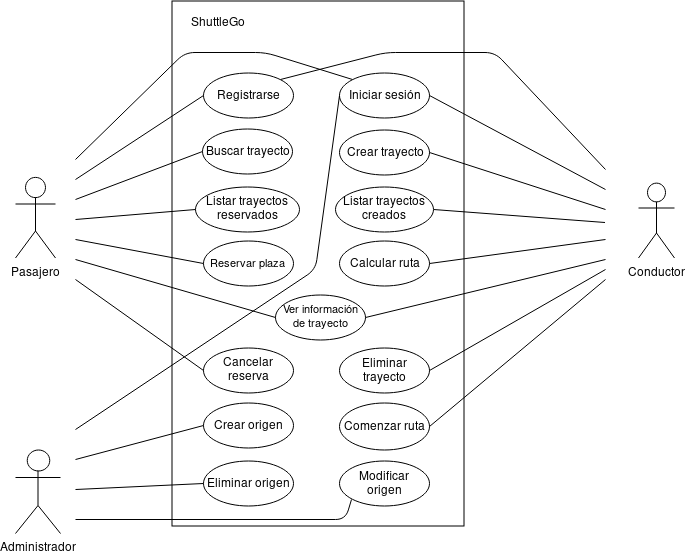

Figura 1. Diagrama de casos de uso de la aplicación

A continuación se explican los actores que intervienen en la aplicación:

  - > Administrador: únicamente una persona desempeña este rol y es el
    > encargado de registrar nuevos puntos de origen para los trayectos
    > que crearán y contratarán los demás actores.

  - > Conductor: este rol puede ser interpretado por múltiples personas
    > y su objetivo es la creación y gestión de nuevos trayectos,
    > introduciendo su punto de origen y el área límite de su servicio
    > para que los pasajeros puedan contratarlo.

  - > Pasajero: el rol de pasajero puede ser adoptado por múltiples
    > personas y su papel fundamental es la contratación y gestión de
    > los trayectos publicados por los conductores.

En las siguientes tablas se van a describir los casos de uso agrupados
por los diferentes actores que intervienen.

### 4.1. Conductor

<table>
<thead>
<tr class="header">
<th><strong>C-1. Registro</strong></th>
<th></th>
</tr>
</thead>
<tbody>
<tr class="odd">
<td><strong>Precondición</strong></td>
<td><ul>
<li>
Los datos deben cumplir una serie de condiciones:

<ul>
<li>
Debe elegir entre el tipo de usuario (conductor).
</li>
<li>
El correo debe existir y ser único.
</li>
<li>
El teléfono móvil debe ser único.
</li>
</ul></li>
</ul>
<ul>
<li>
A parte de estas restricciones se debe introducir los nombre y apellidos del conductor.
</li>
</ul></td>
</tr>
<tr class="even">
<td><strong>Postcondición</strong></td>
<td>La base de datos deberá contener la información del usuario (Nombre, correo, contraseña, teléfono...) y se mostrará un mensaje informando de que el registro ha sido realizado correctamente.</td>
</tr>
<tr class="odd">
<td><strong>Descripción</strong></td>
<td>Se muestra un formulario para introducir las credenciales y datos del conductor.</td>
</tr>
</tbody>
</table>

| **C-2. Iniciar sesión** |                                                                                                                                                                                                                             |
| ----------------------- | --------------------------------------------------------------------------------------------------------------------------------------------------------------------------------------------------------------------------- |
| **Precondición**        | Los campos de entrada deben estar correctamente introducidos.                                                                                                                                                               |
| **Postcondición**       | El conductor podrá acceder a toda la funcionalidad de la aplicación con su sesión si las credenciales son correctas.                                                                                                        |
| **Descripción**         | Una vez sus credenciales hayan sido validadas, el conductor puede acceder a todas las funcionalidades de la aplicación desde su sesión, en caso contrario se mantendrá en la página de inicio indicando los datos erróneos. |

<table>
<thead>
<tr class="header">
<th><strong>C-3. Crear trayecto</strong></th>
<th></th>
</tr>
</thead>
<tbody>
<tr class="odd">
<td><strong>Precondición</strong></td>
<td><ul>
<li>
El conductor debe tener abierta una sesión.
</li>
<li>
Deben existir unos puntos de salida predefinidos por el administrador, entre los que el conductor puede elegir.
</li>
<li>
Se debe establecer la hora de salida.
</li>
<li>
Se debe establecer un código postal que delimite la zona de parada de los pasajeros.
</li>
<li>
Se debe indicar el número de pasajeros máximo que puede albergar el shuttle bus.
</li>
</ul></td>
</tr>
<tr class="even">
<td><strong>Postcondición</strong></td>
<td>En la base de datos quedará registrado el nuevo trayecto y se mostrará un mensaje al conductor indicando que la operación se ha realizado correctamente.</td>
</tr>
<tr class="odd">
<td><strong>Descripción</strong></td>
<td>El conductor elige un punto de inicio, una hora de salida, un máximo de pasajeros y la zona en la que puede realizar las paradas, y de esta forma, se crea un nuevo trayecto.</td>
</tr>
</tbody>
</table>

<table>
<thead>
<tr class="header">
<th><strong>C-4. Cancelar viaje</strong></th>
<th></th>
</tr>
</thead>
<tbody>
<tr class="odd">
<td><strong>Precondición</strong></td>
<td><ul>
<li>
El conductor debe tener abierta una sesión.
</li>
<li>
El viaje que se va a cancelar debe existir.
</li>
<li>
El viaje que se va a cancelar no puede tener pasajeros inscritos.
</li>
</ul></td>
</tr>
<tr class="even">
<td><strong>Postcondición</strong></td>
<td>Se eliminará ese viaje de la base de datos y se mostrará una notificación indicando el éxito de la operación.</td>
</tr>
<tr class="odd">
<td><strong>Descripción</strong></td>
<td>El conductor puede cancelar cualquier viaje en el que no haya pasajeros inscritos.</td>
</tr>
</tbody>
</table>

<table>
<thead>
<tr class="header">
<th><strong>C-5. Calcular ruta</strong></th>
<th></th>
</tr>
</thead>
<tbody>
<tr class="odd">
<td><strong>Precondición</strong></td>
<td><ul>
<li>
El conductor debe tener abierta una sesión.
</li>
<li>
Debe de haberse creado el trayecto.
</li>
<li>
Debe existir como mínimo un cliente que solicite el servicio.
</li>
</ul></td>
</tr>
<tr class="even">
<td><strong>Postcondición</strong></td>
<td>La aplicación generará una ruta óptima automáticamente que pase por todos los puntos que soliciten los pasajeros empezando por el punto de inicio.</td>
</tr>
<tr class="odd">
<td><strong>Descripción</strong></td>
<td>Se muestra un mapa con la ruta calculada.</td>
</tr>
</tbody>
</table>

<table>
<thead>
<tr class="header">
<th><strong>C-6. Comenzar ruta</strong></th>
<th></th>
</tr>
</thead>
<tbody>
<tr class="odd">
<td><strong>Precondición</strong></td>
<td><ul>
<li>
El conductor debe tener abierta una sesión.
</li>
<li>
Debe de haberse calculado ya una ruta.
</li>
<li>
El conductor debe estar en el punto de partida de la ruta.
</li>
</ul></td>
</tr>
<tr class="even">
<td><strong>Postcondición</strong></td>
<td>La aplicación se moverá en el mapa hasta el punto de inicio de la ruta y seguirá los movimientos del conductor.</td>
</tr>
<tr class="odd">
<td><strong>Descripción</strong></td>
<td>Se mueve el mapa hasta el punto de partida y a continuación sigue los movimientos del conductor como un GPS.</td>
</tr>
</tbody>
</table>

| **C-7. Listar trayectos creados** |                                                                      |
| --------------------------------- | -------------------------------------------------------------------- |
| **Precondición**                  | El conductor debe tener abierta la sesión.                           |
| **Postcondición**                 | Se imprimirá por pantalla una lista con todos los trayectos creados. |
| **Descripción**                   | Se muestra una lista con los viajes creados.                         |

### 4.2. Pasajero

<table>
<thead>
<tr class="header">
<th><strong>P-1. Registro</strong></th>
<th></th>
</tr>
</thead>
<tbody>
<tr class="odd">
<td><strong>Precondición</strong></td>
<td><ul>
<li>
Los datos deben cumplir una serie de condiciones:

<ul>
<li>
Debe elegir el tipo de usuario (pasajero).
</li>
<li>
El correo debe existir y ser único.
</li>
<li>
La contraseña debe de cumplir un mínimo de seguridad.
</li>
<li>
El teléfono móvil debe ser único.
</li>
</ul></li>
</ul>
<ul>
<li><blockquote>

A parte de estas restricciones se debe introducir los nombre y apellidos del pasajero.

</blockquote></li>
</ul></td>
</tr>
<tr class="even">
<td><strong>Postcondición</strong></td>
<td>La base de datos deberá contener la información del usuario (Nombre, correo, contraseña, teléfono…) y se mostrará un mensaje informando de que el registro ha sido realizado correctamente.</td>
</tr>
<tr class="odd">
<td><strong>Descripción</strong></td>
<td>Se muestra un formulario para introducir las credenciales y datos del pasajero.</td>
</tr>
</tbody>
</table>

| **P-2. Iniciar sesión** |                                                                                                                                                                                                                             |
| ----------------------- | --------------------------------------------------------------------------------------------------------------------------------------------------------------------------------------------------------------------------- |
| **Precondición**        | Los campos de entrada deben estar correctamente introducidos.                                                                                                                                                               |
| **Postcondición**       | El pasajero podrá acceder a toda la funcionalidad de la aplicación con su sesión si las credenciales son correctas.                                                                                                         |
| **Descripción**         | Una vez sus credenciales hayan sido validadas, el pasajero puede acceder a todas las funcionalidades de la aplicación desde su sesión, en caso contrario, se mantendrá en la página de inicio indicando los datos erróneos. |

<table>
<thead>
<tr class="header">
<th><strong>P-3. Buscar trayecto</strong></th>
<th></th>
</tr>
</thead>
<tbody>
<tr class="odd">
<td><strong>Precondición</strong></td>
<td><ul>
<li>
El pasajero debe tener abierta la sesión.
</li>
<li>
El origen debe existir.
</li>
<li>
El destino debe existir.
</li>
</ul></td>
</tr>
<tr class="even">
<td><strong>Postcondición</strong></td>
<td>Se mostrarán las horas de salida de los diferentes shuttle bus cuyo punto de salida coincida con el punto establecido por el pasajero y cuyo destino se encuentre dentro del área establecida por el conductor.</td>
</tr>
<tr class="odd">
<td><strong>Descripción</strong></td>
<td>El pasajero elige uno de los puntos de partida predefinidos de los shuttle bus e introduce el destino al que desea ir, entonces se muestra una lista con las diferentes horarios disponibles.</td>
</tr>
</tbody>
</table>

<table>
<thead>
<tr class="header">
<th><strong>P-4. Cancelar reserva</strong></th>
<th></th>
</tr>
</thead>
<tbody>
<tr class="odd">
<td><strong>Precondición</strong></td>
<td><ul>
<li>
El pasajero debe tener abierta la sesión.
</li>
<li>
El viaje debe existir.
</li>
</ul></td>
</tr>
<tr class="even">
<td><strong>Postcondición</strong></td>
<td>Se borrará de la base de datos para ese viaje y se mostrará un mensaje indicando el éxito de la operación.</td>
</tr>
<tr class="odd">
<td><strong>Descripción</strong></td>
<td>El pasajero puede cancelar un viaje al que se haya inscrito.</td>
</tr>
</tbody>
</table>

<table>
<thead>
<tr class="header">
<th><strong>P-5. Reservar plaza</strong></th>
<th></th>
</tr>
</thead>
<tbody>
<tr class="odd">
<td><strong>Precondición</strong></td>
<td><ul>
<li>
El pasajero debe tener abierta la sesión.
</li>
<li>
Debe existir la ruta en la que desea reservar plaza.
</li>
<li>
El autobús debe de tener plazas libres.
</li>
</ul></td>
</tr>
<tr class="even">
<td><strong>Postcondición</strong></td>
<td>La reserva queda registrada en la base de datos y se mostrará un mensaje al pasajero indicando que la operaci´n se ha realizado correctamente.</td>
</tr>
<tr class="odd">
<td><strong>Descripción</strong></td>
<td>El pasajero puede reservar plaza para cualquier trayecto que haya buscado y no esté completo.</td>
</tr>
</tbody>
</table>

| **P-6. Listar trayectos reservados** |                                                                                                    |
| ------------------------------------ | -------------------------------------------------------------------------------------------------- |
| **Precondición**                     | El pasajero debe tener abierta la sesión.                                                          |
| **Postcondición**                    |                                                                                                    |
| **Descripción**                      | Se muestra una lista con los viajes en los que se ha reservado, así como sus opciones disponibles. |

###  4.3 Administrador

| **A-1. Iniciar sesión** |                                                                                                                                                                                                                                 |
| ----------------------- | ------------------------------------------------------------------------------------------------------------------------------------------------------------------------------------------------------------------------------- |
| **Precondición**        | Los campos de entrada deben estar correctamente introducidos.                                                                                                                                                                   |
| **Postcondición**       | El administrador podrá acceder a toda la funcionalidad de la aplicación con su sesión si las credenciales son correctas.                                                                                                        |
| **Descripción**         | Una vez sus credenciales hayan sido validadas, el administrador puede acceder a todas las funcionalidades de la aplicación desde su sesión, en caso contrario, se mantiene en la página de inicio indicando los datos erróneos. |

<table>
<thead>
<tr class="header">
<th><strong>A-2. Introducir origen</strong></th>
<th></th>
</tr>
</thead>
<tbody>
<tr class="odd">
<td><strong>Precondición</strong></td>
<td><ul>
<li>
El administrador debe tener abierta la sesión.
</li>
<li>
Se debe dar un nombre a la ubicación.
</li>
<li>
Se debe dar una ubicación correcta.
</li>
</ul></td>
</tr>
<tr class="even">
<td><strong>Postcondición</strong></td>
<td>La nueva ubicación será añadida a la base de datos y se mostrará un mensaje al administrador indicando si se ha introducido correctamente.</td>
</tr>
<tr class="odd">
<td><strong>Descripción</strong></td>
<td>El administrador puede añadir ubicaciones a la base de datos desde las que los shuttle bus podrán salir.</td>
</tr>
</tbody>
</table>

<table>
<thead>
<tr class="header">
<th><strong>A-3. Eliminar origen</strong></th>
<th></th>
</tr>
</thead>
<tbody>
<tr class="odd">
<td><strong>Precondición</strong></td>
<td><ul>
<li>
El administrador debe tener abierta la sesión.
</li>
<li>
La ubicación debe existir.
</li>
<li>
No debe haber trayectos usando ese origen.
</li>
</ul></td>
</tr>
<tr class="even">
<td><strong>Postcondición</strong></td>
<td>La ubicación desaparecerá de la base de datos y se mostrará un mensaje al administrador indicando el éxito de la operación.</td>
</tr>
<tr class="odd">
<td><strong>Descripción</strong></td>
<td>El administrador puede eliminar las ubicaciones a la base de datos.</td>
</tr>
</tbody>
</table>

<table>
<thead>
<tr class="header">
<th><strong>A-4. Modificar origen</strong></th>
<th></th>
</tr>
</thead>
<tbody>
<tr class="odd">
<td><strong>Precondición</strong></td>
<td><ul>
<li>
El administrador debe tener abierta la sesión.
</li>
<li>
La ubicación debe existir.
</li>
</ul></td>
</tr>
<tr class="even">
<td><strong>Postcondición</strong></td>
<td>Se modificarán los datos del origen en la base de datos y se mostrará un mensaje al usuario indicando cómo ha salido la operación.</td>
</tr>
<tr class="odd">
<td><strong>Descripción</strong></td>
<td>Se puede modificar el nombre o las coordenadas del origen.</td>
</tr>
</tbody>
</table>

## 5\. MODELO DE DATOS

En este capítulo se describe el modelo de datos utilizado para llevar a
cabo la persistencia de la información gestionada por la aplicación.

### 5.1. Modelo Entidad-Relación

> En la Figura 2 se muestra el diagrama Entidad-Relación que representa
> la base de datos de la aplicación:

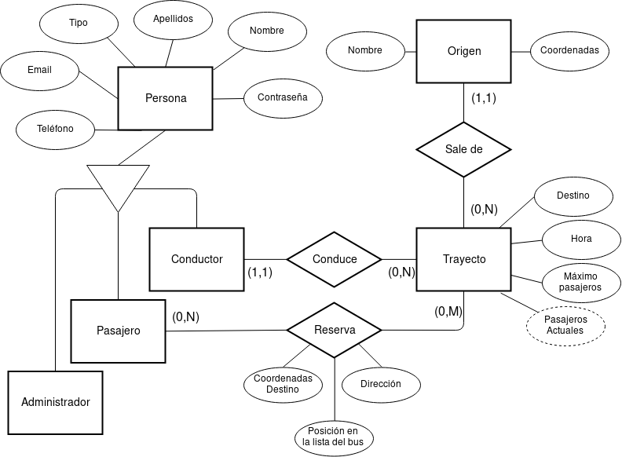

Figura 2. Modelo Entidad-Relación

> A continuación se detallan las entidades del diagrama Entidad-Relación
> anteriormente mostrado:

  - > Persona: representa todos los usuarios que interactúan con la
    > aplicación. Tiene la típica información personal (nombre,
    > apellidos, email y teléfono), además de una contraseña para
    > autentificarse. De esta entidad heredan otras tres con los mismos
    > atributos pero con diferentes relaciones: “Conductor”, “Pasajero”
    > y “Administrador”. “Administrador” no tiene relación con ninguna
    > otra entidad dentro de la aplicación.

  - > Trayecto: simboliza un viaje desde que se da de alta hasta que
    > finaliza. Sus atributos son: la hora de salida, el número máximo
    > de pasajeros y los pasajeros que han reservado hasta el momento.
    > Este último atributo se puede calcular mediante el resto de datos,
    > pero tiene la suficiente relevancia para ser indicado en el
    > diagrama.

  - > Origen: representa el punto de salida de un trayecto. Se trata
    > como una entidad aparte y no como un atributo de “Trayecto” ya que
    > de esta forma, se evita la inconsistencia de nombres entre los
    > conductores. Esto obliga, por ejemplo, a que todos los trayectos
    > que salgan de zonas cercanas a “Avenida América”, se agrupen
    > juntos en la aplicación bajo el origen “Avenida de América”.

> A continuación se explican las relaciones que tienen entre sí cada una
> de las entidades del diagrama Entidad-Relación:

  - > Un conductor puede conducir varios trayectos, pero un trayecto
    > solo puede ser conducido por un conductor.

  - > Un pasajero puede reservar varios trayectos y un trayecto casi
    > siempre tiene reservas de varios pasajeros. Cuando un pasajero
    > reserva, debe indicar dónde se quiere bajar, esto lo hace mediante
    > unas coordenadas y una dirección. Además se le asigna una posición
    > en la lista del autobús.

  - > Un trayecto sale de un origen y de un origen pueden salir varios
    > trayectos.

> No se han representado los atributos que realizan la función de clave
> primaria con el objetivo de mejorar la legibilidad del diagrama
> Entidad-Relación ya que, al ser simplemente Ids, no aportan
> información relevante para la comprensión básica del modelo de datos.

### 5.2. Base de datos NoSQL

> Una vez definida la estructura básica mediante el modelo E-R, se
> decidió implementarla en Firebase el cual ofrece una base de datos
> noSQL llamada Firestore. A pesar de ser noSQL y de que JavaScript es
> un lenguaje débilmente tipado, mediante el uso de los ids generados
> automáticamente por Firestore se ha decidido organizar los datos de la
> siguiente forma para evitar inconsistencias (Figura 3):

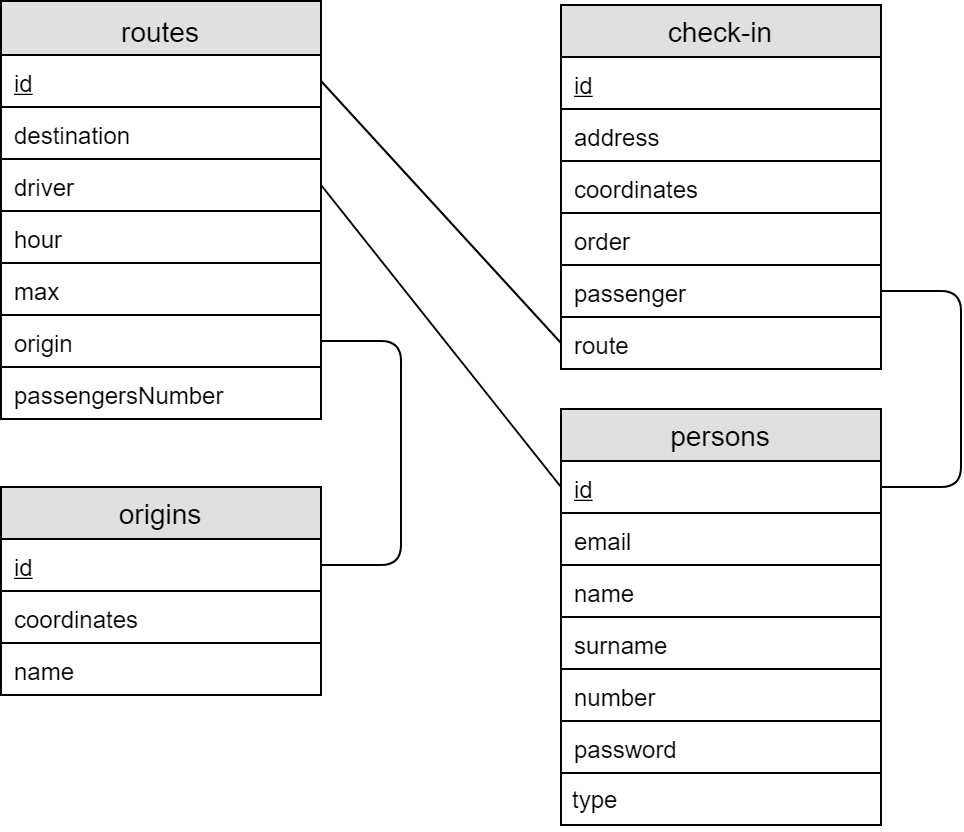

> Figura 3. Esquema de la base de datos.
> 
> A continuación, se explica cada una de las colecciones y los campos
> que contienen los documentos que forman parte de cada colección:

  - > *persons*: Esta colección se encarga de almacenar datos relevantes
    > de todas las personas que están usando esta aplicación (Figura 4).
    > Los datos que se guardan en los documentos son los mismos
    > independientemente del tipo de usuario que sea ya que los
    > atributos no varían.
    
      - > email: el email debe ser único para cada persona, aunque no se
        > usa como elemento diferenciador entre los usuarios, de eso se
        > encarga el id.
    
      - > name: el nombre del usuario.
    
      - > surname: apellido del usuario.
    
      - > number: número de teléfono.
    
      - > password: contraseña necesaria para entrar a la aplicación.
    
      - > type: tipo de usuario de la aplicación. Puede adquirir tres
        > valores posibles: “passenger” (pasajero), “driver” (conductor)
        > y “admin” (administrador). Este atributo se utiliza con mucha
        > frecuencia para saber si un determinado usuario tiene permiso
        > para realizar una determinada petición o para redirigir a una
        > vista en concreto.

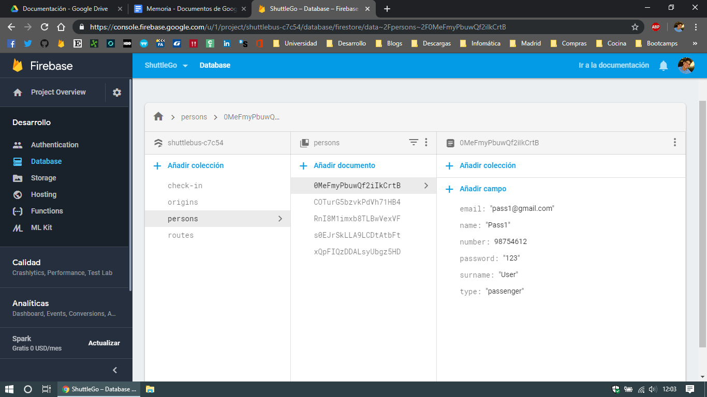

> Figura 4. Documento *person* en Firebase

  - > *origins*: almacena los orígenes introducidos por el administrador
    > (Figura 5).
    
      - > coordinates: las coordenadas del origen.
    
      - > name: el nombre de la calle, plaza, terminal, etc desde donde
        > partirá el bus.

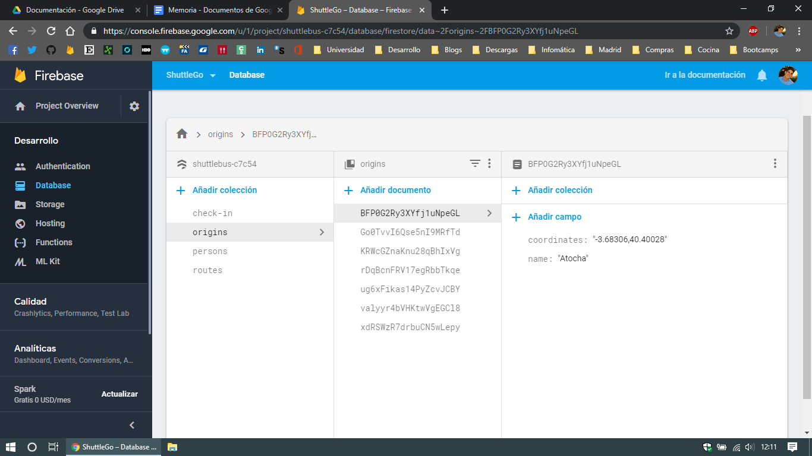

> Figura 5. Documento *origin* en Firebase.

  - > *routes*: Contiene la información de las rutas actuales (Figura
    > 6).
    
      - > destination: el destino se especifica con el código postal: el
        > conductor elige el código postal de la zona donde quiere
        > realizar las paradas y los pasajeros cuya ubicación está
        > dentro de ese código, podrán incluirse en el viaje.
    
      - > driver: id del conductor que realizará el trayecto.
    
      - > hour: hora de salida. Este atributo sirve para que, una vez el
        > pasajero haya seleccionado un origen y un destino, se
        > despliegue una lista con todos los trayectos con sus horas de
        > salida y pueda elegir la más conveniente.
    
      - > max: número máximo de pasajeros que puede llevar el shuttle
        > bus. Cuando el número de pasajeros actual es igual a este
        > número, no se permiten más reservas.
    
      - > origin: id del origen de la ruta.
    
      - > passengersNumbers: número de pasajeros que se han inscrito al
        > viaje. Aunque este número se puede calcular a partir de otros
        > datos, se decidió que tener este atributo era una mejor opción
        > por motivos de eficiencia.

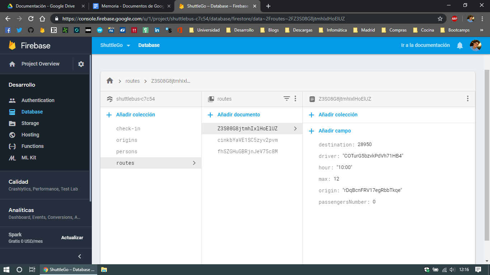

> Figura 6. Documento *route* en Firebase.

  - > *check-in*: Guarda las inscripciones que hacen los pasajeros al
    > añadirse a un trayecto (Figura 7). Mediante esta tabla se pueden
    > obtener los viajes a los que está inscrito un pasajero o los
    > pasajeros que están apuntados a un determinado trayecto, así como
    > su lugar de destino.
    
      - > address: dirección completa donde el pasajero se quiere bajar
        > (ej:”Calle del Dr. Severo Ochoa...”). Este atributo se usa en
        > la aplicación únicamente para mejorar la experiencia de
        > usuario, para la lógica el sistema utiliza las coordenadas.
    
      - > coordinates: coordenadas del lugar donde se quiere bajar el
        > pasajero.
    
      - > order: posición en la lista del autobús.
    
      - > passenger: id del pasajero.
    
      - > route: id de la ruta a la que se ha inscrito el pasajero.

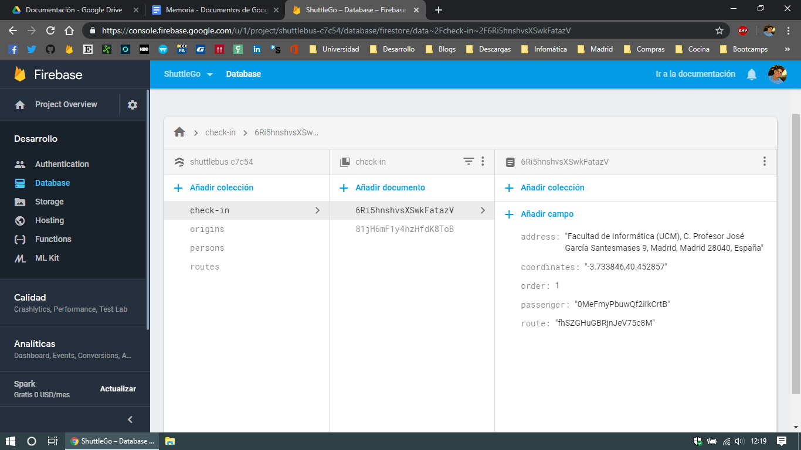

> Figura 7. Documento *check-in* en Firebase.
> 
> Los ids son generados automáticamente por Firestore, en la mayoría de
> casos se usa para referenciar datos entre diferentes colecciones como
> se puede ver en el diagrama, aunque en el caso de “Check-in”, se
> podría prescindir del mismo. En la tabla persons se podría haber
> usado el email, pero se usó el id como referencia para facilitar la
> modificación del correo y evitar un conflicto de la relaciones entre
> los datos.

## 6\. ARQUITECTURA

En este capítulo se explicará la arquitectura de la aplicación y se
detallarán las diferentes capas de las que consta la aplicación, así
como la organización interna de la misma.

La arquitectura de la aplicación desarrollada utiliza el patrón
cliente-servidor: el cliente se encarga de la interacción del sistema
con el usuario, mientras que la función del servidor consiste en
asegurarse de que se cumplan todas las reglas de negocio así como de
interactuar con la base de datos. El diálogo entre cliente y servidor se
realiza mediante peticiones https. De esta forma, la aplicación tendría
la estructura que se muestra en la Figura 8:

> 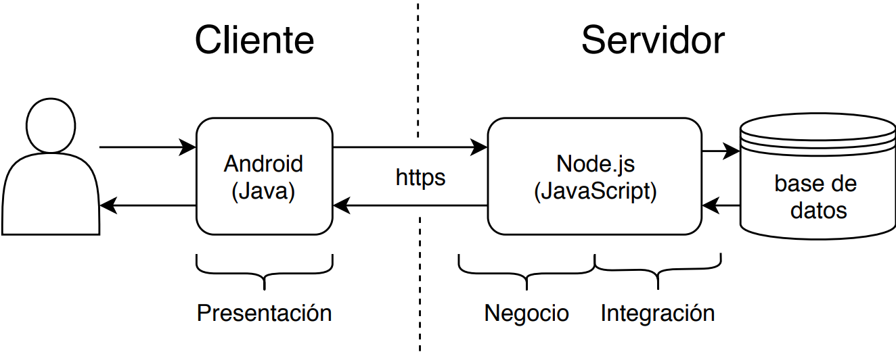
> 
> Figura 8. Arquitectura de la aplicación.

El cliente está desarrollado siguiendo una arquitectura multicapa
formada por dos capas: actividad y modelo. En la Figura 9 se muestra un
esquema de la arquitectura del cliente:

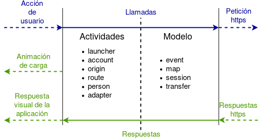

Figura 9. Arquitectura del cliente

La capa de actividades es aquella que más carga de trabajo adopta en el
cliente, ya que es la encargada de aplicar toda la lógica de renderizado
de las vistas, así como de aplicar las validaciones previas a las
peticiones al servidor para evitar fallos de ejecución en el mismo
(datos con formato erróneo o campos vacíos). Además, se encarga de
lanzar eventos a la capa de modelo. Los paquetes que forman esta capa
son:

  - > *Paquete launcher*: es el encargado de lanzar la aplicación y de
    > inicializar los componentes necesarios para la realización de la
    > misma.

<!-- end list -->

  - > *Paquete account*: es el encargado de realizar el registro y el
    > inicio de sesión por parte de los usuarios.

  - > *Paquete origin*: es el encargado de la lógica de presentación del
    > módulo Orígen, sus principales funcionalidades son la de mostrar,
    > listar, modificar y eliminar orígenes.

  - > *Paquete route*: es el encargado del módulo Ruta, al igual que en
    > el paquete anterior este se encarga de mostrar, listar, modificar
    > y eliminar rutas con la excepción de la que la lógica de
    > renderizado que debe aplicar este paquete debe diferenciar entre
    > el usuario que esté realizando las peticiones, ya que las vistas y
    > parte de la funcionalidad se ven alteradas ligeramente dependiendo
    > de si el rol adoptado en ese momento por el usuario es de
    > conductor o pasajero.

  - > *Paquete person*: es el encargado de la renderización de las
    > vistas de los diferentes roles que puede adoptar el usuario
    > (administrador, conductor o pasajero), así como de controlar las
    > diferentes peticiones que se realizarán dependiendo del rol
    > comentado anteriormente.

  - > *Paquete adapter*: es el encargado de la renderización de las
    > listas de todos los módulos.

La capa de modelo es la encargada de realizar la interacción con el
servidor, realizar las peticiones con los datos que llegan de las capas
superiores así como albergar toda la lógica que implementa la aplicación
con respecto a la gestión de los mapas que se utilizan en la aplicación.
Los paquetes que forman esta capa son:

  - > *Paquete event*: realiza las peticiones al servidor mediante la
    > API de Firebase y retorna las respuestas a la capa de actividad.

  - > *Paquete map*: se encarga de interactuar con la API de MapBox para
    > realizar el cálculo de la ruta y la búsqueda de direcciones.

  - > *Paquete session*: contiene un singleton que se encarga de guardar
    > las credenciales del usuario que ha iniciado sesión con el fin de
    > validar las peticiones que se mandan al servidor y mejorar la
    > seguridad de dichas peticiones.

  - > *Paquete transfer*: contiene los transfers que intervienen durante
    > todo el desarrollo de la aplicación

En la Figura 10 se muestra la arquitectura multicapa del servidor que
consta de tres capas bien delimitadas:

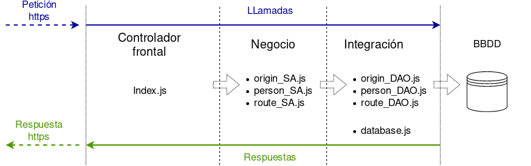

Figura 10. Arquitectura del servidor

  - > *Controlador frontal:* representado por el archivo “index.js". Es
    > el encargado de recibir las peticiones. Realiza pequeñas
    > validaciones de datos que están estrechamente ligados al formato
    > de las peticiones y que podrían suponer un error de ejecución (ej:
    > comprobar que no lleguen los datos vacíos) además de validaciones
    > de autorización (ej: comprobar que el usuario que ha mandado la
    > petición de eliminar un origen es un administrador).

<!-- end list -->

  - > *Capa de negocio:* formada por todos los servicios de aplicación
    > ubicados en la carpeta "service\_application". El objetivo de esta
    > capa es asegurarse de que se cumplen las diferentes reglas de
    > negocio (ej: No se pueden añadir más pasajeros a un viaje si están
    > todas las plazas ocupadas). Existe un servicio de aplicación por
    > cada entidad.

  - > *Capa de integración:* formada por los "Data Access Objects"
    > (DAOs) de la carpeta "data\_access". Esta capa se encarga de dar
    > acceso al sistema a la base de datos mediante operaciones simples
    > (insertar, borrar, modificar y leer). Al igual que en la capa de
    > negocio, existe un DAO por entidad. Además, esta capa contiene un
    > archivo "database.js" que se encarga de realizar la configuración
    > necesaria para realizar peticiones a la base de datos. Observar
    > que para solucionar el problema de la asincronía a la hora de
    > interactuar con la base de datos, se utilizan promesas, por lo que
    > todas las operaciones devuelven siempre una promesa con el
    > resultado como parámetro.

Para el control de errores existe un archivo “errors.js", donde se
encuentran todos los errores posibles que le pueden llegar al cliente
junto a una descripción de cuál puede ser la causa.

Observar que esta separación en capas permite que la lógica de negocio
sea independiente de la plataforma. De esta forma, si es necesario
cambiar el servicio que aloja el código del servidor, solo habría que
hacer cambios en el controlador, y si se cambia la forma en la que los
datos son almacenados, sólo habría que cambiar los DAOs.

## 7\. DISEÑO DE LA APLICACIÓN

En el siguiente capítulo se detalla el diseño con el que cuenta la
aplicación junto con su funcionalidad y las implementaciones de las
mismas.

### 7.1.Análisis preliminar

> Para el desarrollo de este proyecto, se ha querido maximizar la
> usabilidad de la aplicación intentando, dentro de lo posible, cumplir
> con la mayoría de sus objetivos como la mejora de la eficiencia, la
> facilidad de aprendizaje o la satisfacción del usuario. La disposición
> de los elementos en las vistas, el menú desplegable o las barras de
> búsqueda en el mapa, tienen un estilo similar a otras aplicaciones
> populares, por lo que los nuevos usuarios no tendrán demasiados
> problemas para desenvolverse con la aplicación.
> 
> A nivel de diseño interno y codificación, se ha intentado adaptar
> patrones de diseño a las dos plataformas en las que se ha desarrollado
> el proyecto, con el objetivo de hacer un software lo más escalable,
> mantenible y robusto posible. El código cuenta con una documentación
> completa y una estructura coherente, limpia y legible.

### 7.2. Funcionalidades e implementaciones del cliente

> En las siguientes secciones se detallarán las diferentes
> funcionalidades con las que cuenta la aplicación.

#### 7.2.1 Crear y eliminar usuarios, orígenes y trayectos

> Todos los documentos de los que consta la base de datos son definidos
> por un identificador único autogenerado por el sistema. Para la
> inserción de cada uno de dichos documentos, la aplicación consta de
> formularios que son completados por el usuario para crear las nuevas
> instancias.
> 
> Los formularios relacionados con el usuario son los encargados de
> realizar el registro (Figura 11 y Figura 12), en el que se pide un
> email único, una contraseña, el tipo de usuario, nombre, apellidos y
> un número de teléfono. Es importante destacar que los usuarios no
> cuentan con la posibilidad de registrarse como “administrador” ya que
> cuenta con unas funcionalidades restringidas.

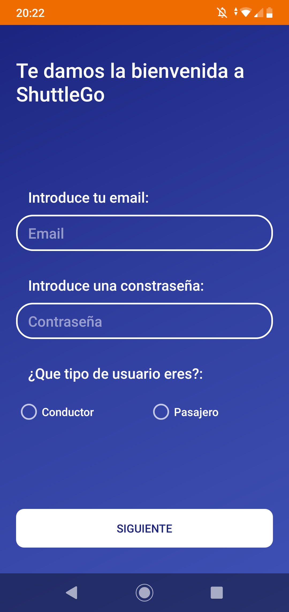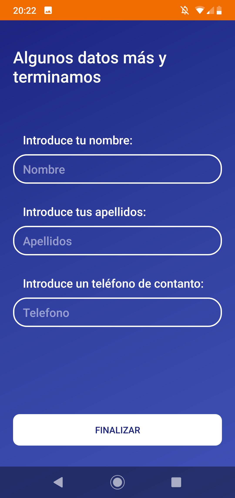

> Figura 11. Registro 1 Figura 12. Registro 2
> 
> Otro de los formularios de usuario es el relacionado con el inicio de
> sesión que permite acceder a las funcionalidades de su perfil (Figura
> 13). Cuando el correo y la contraseña coincidan con los guardados en
> la base de datos, serán redirigidos a su pantalla principal, la cual
> es diferente en función del actor.

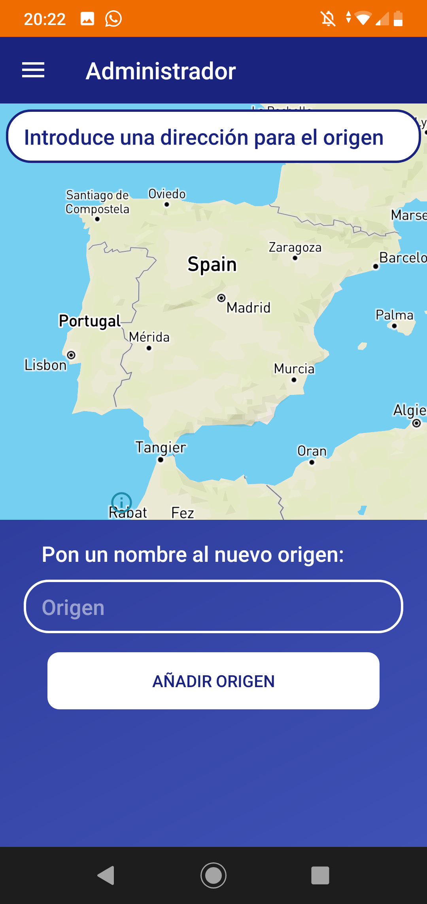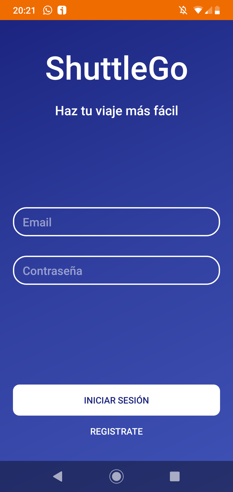

> Figura 13. Inicio de sesión Figura 14. Crear origen
> 
> Para crear un origen, se necesita la localización del mismo y el
> nombre que el administrador decida darle (Figura 14). Por otro lado
> para la creación del trayecto por parte del conductor, el formulario
> debe ser completado con el punto de partida, el área límite en la que
> el conductor quiera ofrecer su servicio, así como el número máximo de
> pasajeros y la hora de salida (Figura 15).
> 
> 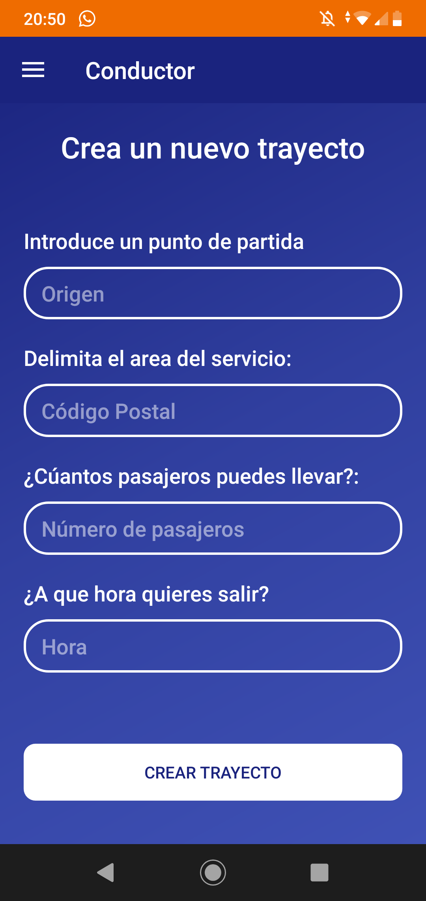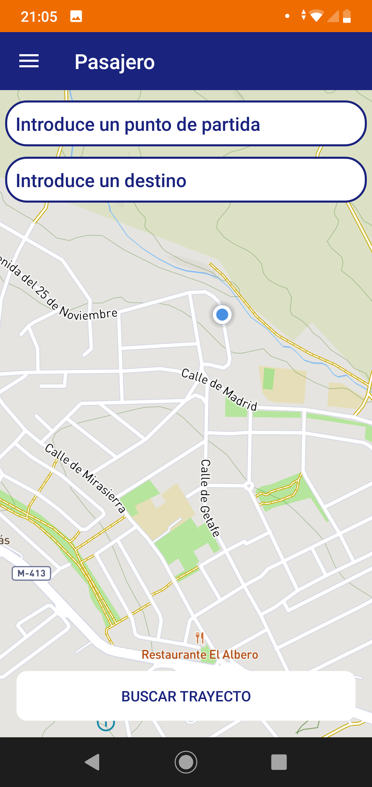
> 
> Figura 15. Crear trayecto Figura 16. Búsqueda de trayecto
> 
> 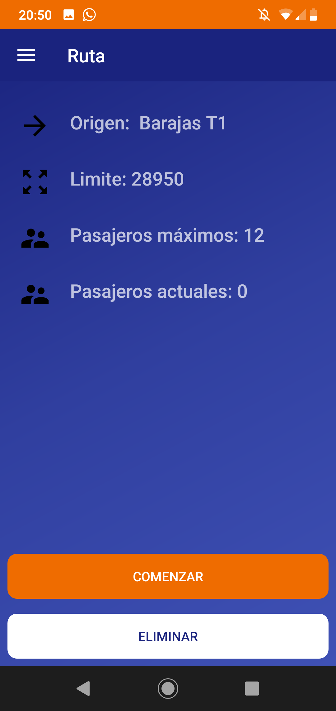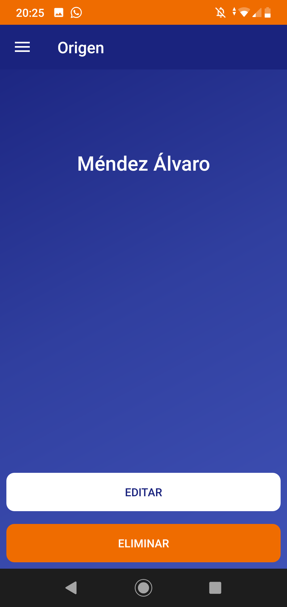
> 
> Figura 17. Eliminar orígen Figura 18. Eliminar trayecto
> 
> Cuando el usuario es un pasajero, para buscar un nuevo trayecto al que
> añadirse, se debe introducir un punto de partida y el destino que al
> que el pasajero desee ir (Figura 16).
> 
> Cada uno de los tres módulos cuenta con un sistema de eliminación. Por
> parte del administrador, se brinda la posibilidad de eliminar
> cualquiera de los orígenes creados (Figura 17). El conductor tiene la
> opción de eliminar un trayecto, siempre y cuando este con contenga
> ninguna reserva (Figura 18). El pasajero podrá cancelar un trayecto
> que haya contratado previamente (Figura 19).
> 
> 
> 
> Figura 19. Cancelar trayecto
> 
> Para la creación o eliminación de cualquiera de los módulos
> anteriormente descritos el servidor cuenta con un esquema de
> implementación muy similar. La parte *back-end* únicamente recibe
> datos en formato JSON, por tanto, los datos de entrada deben ser
> enviados en dicho formato. Una vez que el cliente ha capturado el
> evento que inicia el proceso de creación (Figura 20), se procede a
> encapsular los datos en formato JSON (Figura 21).

<table>
<tbody>
<tr class="odd">
<td>
this.registerButtonFinish.setOnClickListener(this);

public void onClick(View v) {

switch (v.getId()) {

case R.id.main_register_finish_btn:

JSONObject user = buildJson(data);

throwEventRegisterUser(user);

break;

}

}
</td>
</tr>
</tbody>
</table>

> Figura 20. Crear usuario

<table>
<tbody>
<tr class="odd">
<td>
private JSONObject buildJson(Person data_user) {

JSONObject user = new JSONObject();

try {

user.put("user", json);

} catch (JSONException e) {

throwErr(R.string.err);

}

return user;

}
</td>
</tr>
</tbody>
</table>

> Figura 21. Construir JSON
> 
> Una vez finalizado el proceso anterior, se puede proceder a llamar a
> la función encargada de llamar al DispatcherEvent (despachador de
> eventos) (Figura 22) y procesa la respuesta llegada del servidor una
> vez se haya procesado. el DispatcherEvent es el encargado de lanzar la
> petición correcta al servidor (Figura 23).
> 
> Como se puede observar, Firestore facilita el intercambio de datos con
> el servidor mediante el método “getHttpsCallable”.

<table>
<tbody>
<tr class="odd">
<td>
private void throwEventRegisterUser(JSONObject data){

EventDispatcher.getInstance(this)

.dispatchEvent(Event.SIGNUP, data)

.addOnCompleteListener(task -&gt; {

if (!task.isSuccessful())

throwErr(task.getResult().get("error"));

else {

startActivity(new Intent(this, nestClass));

finish();

}

});

}
</td>
</tr>
</tbody>
</table>

> Figura 22. Lanzar evento

<table>
<tbody>
<tr class="odd">
<td>
FirebaseApp.initializeApp(applicationContext);

mFunctions = FirebaseFunctions.getInstance();

public Task dispatchEvent(Event event, JSONObject data){

switch(event){

case SIGNIN: return throwEvent("signin", data);

case SIGNUP: return throwEvent("signup", data);

/* [...] */

default: return null;

}

}

private Task throwEvent(String name,JSONObject data){

return this.mFunctions

.getHttpsCallable(name)

.call(data)

.continueWith(task -&gt; task.getResult()).getData());

}
</td>
</tr>
</tbody>
</table>

> Figura 23. Lanzar petición al servidor

#### 7.2.1 Listar orígenes y trayectos

> Una vez creado varios orígenes, el administrador puede consultar todos
> los disponibles en la base de datos (Figura 24).
> 
> 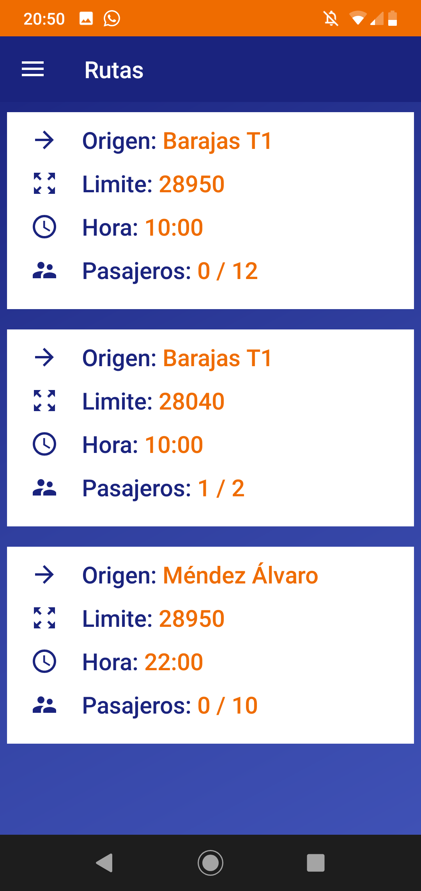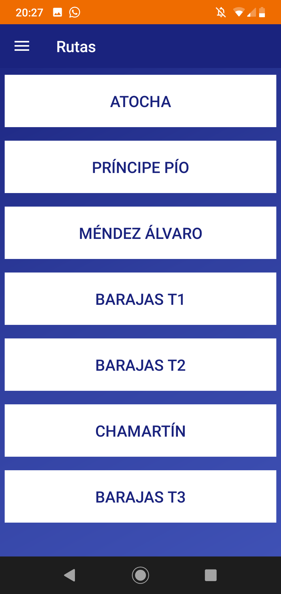
> 
> Figura 24. Listar orígenes Figura 25. Listar trayectos conductor
> 
> 
> 
> Figura 26. Listar trayecto pasajero Figura 27. Listar trayectos
> búsqueda
> 
> Lo mismo ocurre cuando un conductor crea varios trayectos o cuando un
> pasajero se inscribe a alguno. Cabe destacar que en la lista de
> conductor (Figura 25) se muestra el código postal que delimita el área
> de servicio, mientras que en la de pasajero se muestra el nombre del
> destino (Figura 26). También se genera una lista como resultado de la
> búsqueda de un trayecto (Figura 27).
> 
> Los listados dentro de la aplicación se utilizan constantemente por lo
> que es necesario optimizarlos. Android Studio ofrece una sencilla de
> mostrar las listas mediante el uso de RecyclerViews (Figura 28 y
> Figura 29).

<table>
<tbody>
<tr class="odd">
<td>
&lt;LinearLayout

android:layout_width="match_parent"

android:layout_height="match_parent"

android:orientation="vertical" &gt;

&lt;android.support.v7.widget.RecyclerView

android:layout_width="match_parent"

android:layout_height="match_parent" /&gt;

&lt;/LinearLayout&gt;
</td>
</tr>
</tbody>
</table>

> Figura 28. Estructura RecyclerView

<table>
<tbody>
<tr class="odd">
<td>
RecyclerView.LayoutManager layoutManager = new LinearLayoutManager(this);

this.recyclerList.setLayoutManager(layoutManager);
</td>
</tr>
</tbody>
</table>

> Figura 29. Instancia RecyclerView
> 
> Una vez que el servidor ha devuelto la lista de los datos solicitados
> por la petición, se debe instanciar un adaptador (Figura 30), que será
> el encargado de gestionar dicho RecyclerView, renderizando el
> contenido de la lista (Figura 31) y escuchando las peticiones que
> recibe desde el cliente (Figura 32).

<table>
<tbody>
<tr class="odd">
<td>
Adapter&lt;viewHolder&gt; adapter = new Adapter(data_list);

recyclerList.setAdapter(adapter);
</td>
</tr>
</tbody>
</table>

> Figura 30. Instancia Adaptador

<table>
<tbody>
<tr class="odd">
<td>
viewHolder(View v) {

super(v);

this.context = v.getContext();

Cardview card = new Cardview(); //The item to show

}

public void onBindViewHolder(viewHolder h, int i) {

h.card.setText(data_list.get(i).getItem());

h.setOnClickListeners();

}
</td>
</tr>
</tbody>
</table>

> Figura 31. Renderizado de Adaptador

<table>
<tbody>
<tr class="odd">
<td>
void setOnClickListeners() {

this.adapter_button.setOnClickListener(v -&gt; {

/* [...] */

/* send the event */

});

}
</td>
</tr>
</tbody>
</table>

> Figura 32. Captura de eventos Adaptador

#### 7.2.3 Buscar trayectos

> El pasajero introduce un origen y un destino (Figura 33), y a
> continuación se le muestra una lista con todas las horas a las que
> sale un autobús que haga ese recorrido. Cuando introduce el origen, se
> añade un icono de un autobús al mapa en las coordenadas de la
> dirección indicada, y cuando se introduce el destino se añade una
> bandera de meta (Figura 34). En ambos casos se hace zoom para que el
> pasajero pueda asegurarse de que la dirección es correcta y según se
> va escribiendo aparecen sugerencias para el autocompletado.
> 
> 
> 
> Figura 33. Buscar trayecto Figura 34. Visualización origen-destino
> 
> Los editores de texto que incluye el SDK de android tienen múltiples
> funcionalidades entre las que destaca la captura de eventos ante
> cualquier interacción del usuario con dichos elementos. Esta
> funcionalidad se ha aprovechado para realizar búsquedas en tiempo real
> junto con la API de Mapbox.
> 
> Se han implementado los *listeners* que componen esos editores (Figura
> 35) de texto de tal forma que cada vez que el usuario introduce una
> palabra completa, se lanza una petición (Figura 36) a través de la API
> de Mapbox (Figura 37) que devuelve una lista con las direcciones
> coincidentes a la palabra insertada por teclado. Esta lista,
> posteriormente, es mostrada mediante adaptadores.
> 
> Por otro lado, mediante la misma petición se obtienen las coordenadas
> que se usarán para marcar el mapa y calcular la ruta, y el código
> postal con el que se buscarán los trayectos.

<table>
<tbody>
<tr class="odd">
<td>
&lt;LinearLayout

android:layout_width="match_parent"

android:layout_height="wrap_content"

android:orientation="vertical" &gt;

&lt;TextView

android:text="Introduce una dirección" /&gt;

&lt;EditText

android:id="edit_text"

android:hint="Dirección"

android:inputType="text" /&gt;

&lt;LinearLayout /&gt;
</td>
</tr>
</tbody>
</table>

> Figura 35. Estructura editor de texto

<table>
<tbody>
<tr class="odd">
<td>
public void afterTextChanged(Editable s) {

if (s.toString().matches(".*\\s")) {

Map.getInstance(this)

.getFullAddress(s.toString())

.addOnCompleteListener(task-&gt; {

this.edit_text = task.getResult();

ArrayList&lt;String&gt; a_address = new ArrayList&lt;&gt;();

for (Address address : this.edit_text )

a_address .add(address.getAddress());

this.view_adapter.setAdapter(adapter);

});

}

}
</td>
</tr>
</tbody>
</table>

> Figura 36. Capturar eventos editor de texto

<table>
<tbody>
<tr class="odd">
<td>
public Task&lt;?&gt; getFullAddress(String address){

MapboxGeocoding.builder()

.accessToken(Map.accessToken)

.query(address)

.languages("es")

.build()

.enqueueCall(new Callback&lt;..&gt;() {

@Override

public void onResponse(Call call,Response response){

List&lt;?&gt; results = response.body());

for(auto result:results) {

Address address =

new Address(result.placeName(),

result.postalCode());

addresses.add(address );

}

return addresses;

});

}

}
</td>
</tr>
</tbody>
</table>

> Figura 37. Peticiones Mapbox

#### 7.2.4 Calcular y comenza ruta

> Cuando se tenga un mínimo de una parada, se podrá calcular la ruta
> óptima entre todos los puntos mediante la API de Mapbox, la cual en
> su versión gratuita permite un máximo de veinticinco puntos incluyendo
> el origen.
> 
> Una vez calculada la ruta se mostrará el mapa con el camino óptimo que
> pasa por todas las paradas (Figura 38). Si se está lo suficientemente
> cerca del origen, al pulsar “comenzar” el zoom del mapa apuntará a la
> posición del mapa donde se sitúe el conductor y comenzará a seguir sus
> movimientos. En caso contrario, mostrará un mensaje de error (Figura
> 39).

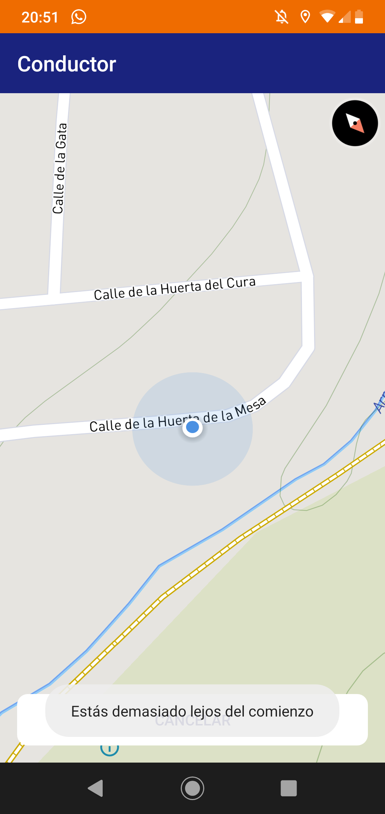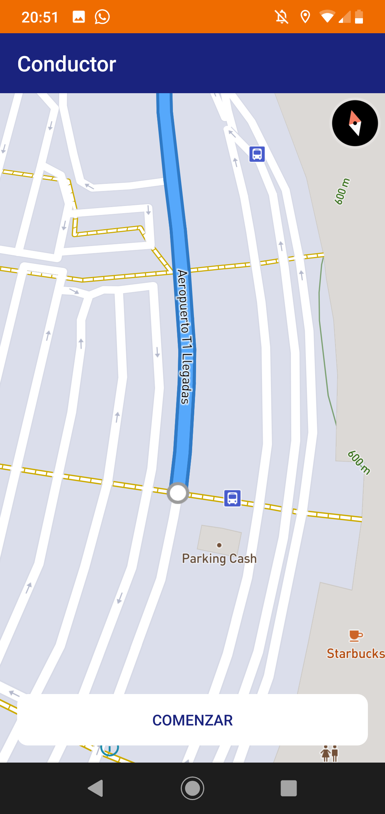

> Figura 38. Ruta calculada Figura 39. Error por distancia
> 
> Para calcular la ruta con Mapbox, primero se introduce el origen, para
> a continuación añadir el resto de paradas. Después, se ejecutará la
> función “getRoute” y con la respuesta, se pintará un camino en el mapa
> (Figura 40).

<table>
<tbody>
<tr class="odd">
<td>
NavigationRoute.Builder builder

= NavigationRoute.builder(context).origin(origin);

for(Point w:waypoints) builder = builder.addWaypoint(w);

builder.build().getRoute(new Callback() {

@Override

public void onResponse(Call call, Response response){

DirectionsRoute route;

route = response.body().routes().get(0)

NavigationMapRoute nmr;

nmr = new NavigationMapRoute(null,mapView,mapboxMap);

nmr.addRoute(route);

}

}
</td>
</tr>
</tbody>
</table>

> Figura 40. Renderizado de ruta

#### 7.2.4 Menú lateral

> Todos los actores que interactúan con el sistema constan de un menú
> desplegable (Figura 41) con el que pueden navegar a por las diferentes
> pantallas de la aplicación a través de sus diferentes opciones.
> 
> 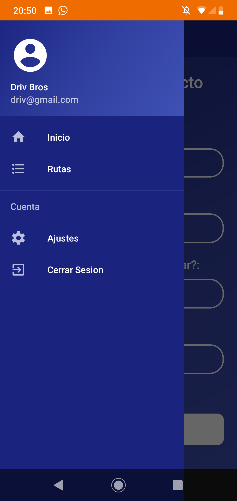
> 
> Figura 41. Menú desplegable
> 
> La implementación del menú lateral es idéntica en los tres módulos, a
> excepción de las opciones que ofrece cada uno de ellos. La interfaz
> está compuesta por un DrawerLayout (Figura 42 y Figura 43) y un
> NavigationView que es el encargado de escuchar los eventos recibidos
> por el menú desplegable (Figura 44).

<table>
<tbody>
<tr class="odd">
<td>
&lt;android.support.v4.widget.DrawerLayout

android:layout_width="match_parent"

android:layout_height="match_parent"&gt;

&lt;include layout="@layout/driver_main_content" /&gt;

&lt;android.support.design.widget.NavigationView

app:headerLayout="@layout/menu_nav_header"

app:menu="@menu/driver_drawer" /&gt;

&lt;/android.support.v4.widget.DrawerLayout&gt;
</td>
</tr>
</tbody>
</table>

> Figura 42. Interfaz DrawerLayout

<table>
<tbody>
<tr class="odd">
<td>
&lt;menu xmlns:android="http://schemas.android.com/apk/res/android"

xmlns:tools="http://schemas.android.com/tools"

tools:showIn="navigation_view"&gt;

&lt;group android:checkableBehavior="single"&gt;

&lt;item

android:id="@+id/driver_drawer_home"

android:icon="@drawable/ic_home"

android:title="@string/home" /&gt;

&lt;item

android:id="@+id/driver_drawer_list"

android:icon="@drawable/ic_list"

android:title="@string/routes" /&gt;

&lt;/group&gt;

&lt;/menu&gt;
</td>
</tr>
</tbody>
</table>

> Figura 43. Contenido menú desplegable

<table>
<tbody>
<tr class="odd">
<td>
this.driver_nav.addDrawerListener(toggle);

this.toggle.syncState();

this.driver_nav.setNavigationItemSelectedListener(this);

public boolean onNavigationItemSelected(MenuItem menuItem) {

switch (menuItem.getItemId()) {

case R.id.driver_drawer_list:

startActivity(new Intent(this, nextClass));

break;

}

this.driver_nav.closeDrawer(GravityCompat.START);

return true;

}
</td>
</tr>
</tbody>
</table>

> Figura 44. Implementación menú desplegable

### 7.3 Funcionalidades e implementaciones del servidor

> Para cualquier funcionalidad explicada anteriormente, la secuencia
> seguida en este lado es básicamente la misma. Cuando la petición llega
> al servidor, el funcionamiento del servidor de forma normal sería el
> siguiente:

1.  > Se ejecuta la función del controlador asociada a la petición,
    > donde primero se realizan comprobaciones de autorización y
    > validación de formato de datos, y si no ha ocurrido ningún error,
    > se llama al método de algún servicio de aplicación (Figura 45).

<table>
<tbody>
<tr class="odd">
<td>
const functions = require("firebase-functions");

exports.signup = functions.https.onCall((data) =&gt; {

return checkData(data)

.then(() =&gt; checkData(data.user))

.then(() =&gt; personSA.signUp(data.user))

.then(() =&gt; { return {signedUp: true} });

});
</td>
</tr>
</tbody>
</table>

> Figura 45. Petición al controlador del servidor
> 
> En este caso, primero se comprueba que el formato con el que llegan
> los datos es el correcto mediante la función “checkData” para a
> continuación llamar al método “signUp” del servicio de aplicación
> “personSA”. Si la respuesta ha sido correcta, se envía un dato de
> confirmación “signedUp: true”. Como se puede observar, Firebase ofrece
> un paquete (“firebase-functions”) que se encarga de manejar el
> intercambio de datos mediante peticiones https.

<table>
<tbody>
<tr class="odd">
<td>
function deleteOriginById(id) {

return originDAO.getOriginById(id)

.then((origin) =&gt; {

if(origin == null) throw ERROR.OrgNotExists;

else return originDAO.deleteOriginById(id);

});

};
</td>
</tr>
</tbody>
</table>

Figura 46. Función del servicio de aplicación

2.  > El servicio de aplicación se encarga de hacer cumplir las reglas
    > de negocio apoyándose en llamadas a las funciones de los DAOs
    > (Figura 46). En este método perteneciente al servicio de
    > aplicación de “origen” (“origin\_SA.js”) se puede observar como
    > se intenta obtener un origen mediante su id, llamando al DAO de
    > origen. Si no se ha encontrado, se devuelve un error, en caso
    > contrario, se elimina.

3.  > Los DAOs interactúan directamente con la base de datos obteniendo,
    > insertando, modificando y borrando documentos (Figura 47).

<table>
<tbody>
<tr class="odd">
<td>
function insertUser(newUser) {

return db.collection("persons").add(newUser)

.then(() =&gt; {

return null;

}, error =&gt; { throw ERROR.server});

}
</td>
</tr>
</tbody>
</table>

Figura 47. Petición del DAO

> En este ejemplo, se intenta insertar un usuario en la base de datos.
> Si se ha insertado con éxito devuelve *null*, y en caso contrario
> lanza un error. El objeto “db” es instanciado en el archivo de
> configuración “database.js” mediante el paquete ofrecido por Firebase
> "firebase-admin" y usado en todos los métodos de los DAOs.

## 8\. EVALUACIÓN

En este capítulo se describe la evaluación realizada sobre la
aplicación. Para ello se ha preparado un guión de pruebas mediante un
formulario de Google que ha sido enviado a un grupo de 20 usuarios para
que puedan probar la aplicación.

### 8.1. Guión de pruebas

> El formulario se ha dividido en dos partes. La primera parte tiene
> como objetivo analizar el perfil de usuario que ha realizado las
> pruebas de la aplicación y la segunda parte tiene como finalidad
> evaluar la opinión que ha generado en los usuarios el uso de la
> aplicación.
> 
> A los encuestados se les pidió que realizaran una serie de pruebas,
> centradas en la funcionalidad principal de la aplicación. A
> continuación se detalla el guión utilizado:

1.  > Iniciar sesión como conductor. NOTA: a los usuarios se les
    > facilita dichas credenciales antes del comienzo de la prueba.

2.  > Dar de alta un nuevo trayecto.

3.  > Cancelar el viaje creado previamente.

4.  > Comenzar un trayecto con pasajeros.

5.  > Hacer un registro como nuevo pasajero.

6.  > Buscar un viaje como pasajero y reservar.

7.  > Cancelar la reserva anteriormente realizada.

### 8.2. Resultados

> Después de haber realizado el guión de pruebas, se les presentó a los
> usuarios un formulario para evaluar la experiencia realizada En las
> figuras . En las siguientes secciones se detallan los resultados de
> dicho formulario.

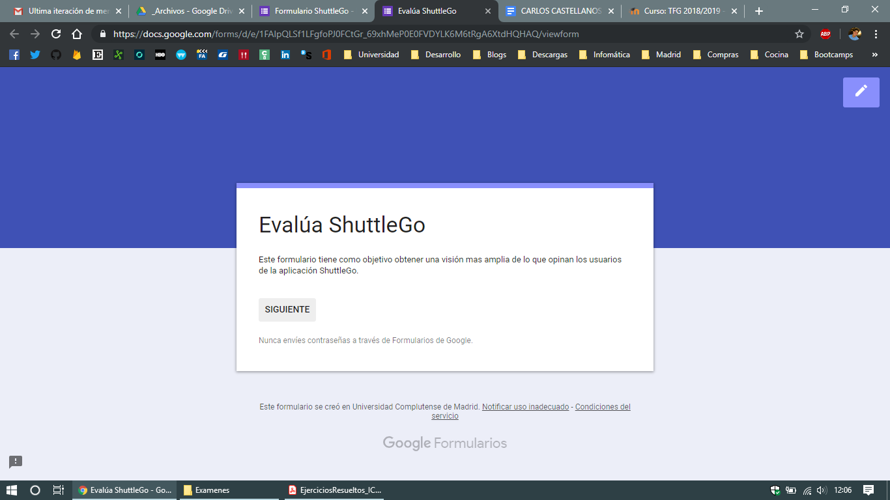

Figura 48. Gráfico de edad

> 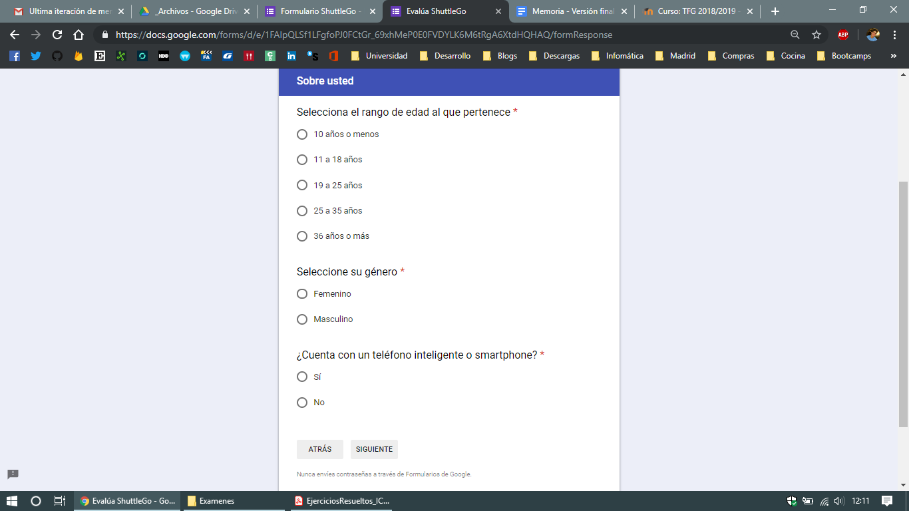

Figura 48. Gráfico de edad

> 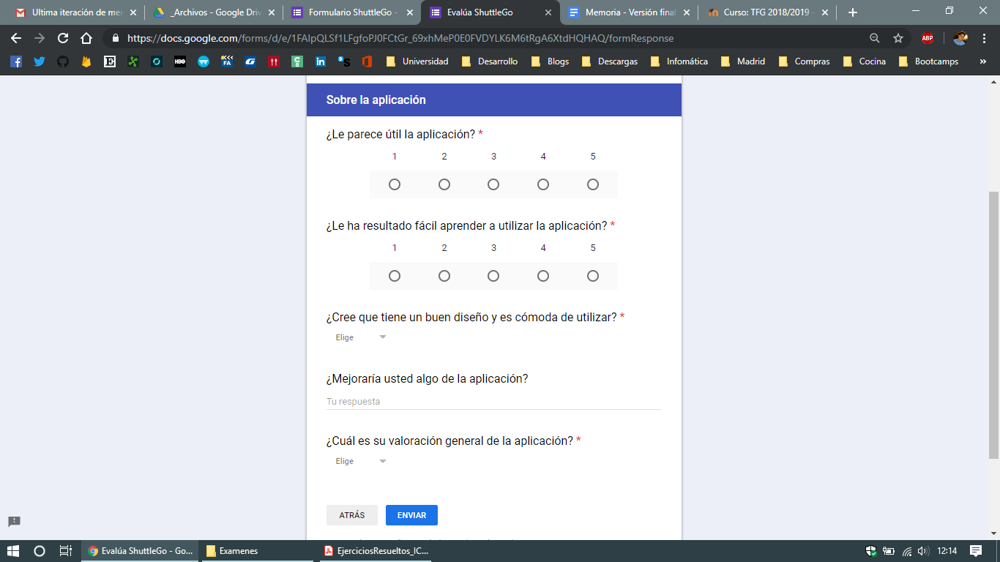

Figura 48. Gráfico de edad

#### 8.2.1 Sobre el usuario

> A continuación se realizará una explicación detallada de los gráficos
> obtenidos tras las encuesta en lo que a perfil de usuario se refiere.

![Gráfico de respuestas de formularios. Título de la
pregunta: Selecciona el rango de edad al que pertenece. Número de
respuestas: 20 respuestas.](media/image57.png' width='20%' height='20%'>

Figura 48. Gráfico de edad

> Como se puede observar en la Figura 48, el 70% de los entrevistados se
> encuentran entre los 19 y los 35 años de edad, siendo la franja
> mayoritaria la comprendida entre los 19 años y los 25 años de edad. El
> 30% restante pertenece a partes iguales a las franjas de edad
> comprendidas en entre los 11 y los 18 años edad, así como la compuesta
> por los que tiene más de 36 años.

![Gráfico de respuestas de formularios. Título de la
pregunta: Seleccione su género. Número de respuestas: 20
respuestas.](media/image15.png' width='20%' height='20%'>

Figura 49. Gráfico de género

> La figura 49 nos muestra una participación género del 50% para cada
> uno de los sexos. En la Figura 50 se puede ver que el 100% de los
> entrevistados cuenta con un teléfono inteligente o un smartphone.

![Gráfico de respuestas de formularios. Título de la pregunta: ¿Cuenta
con un teléfono inteligente o smartphone?. Número de respuestas: 20
respuestas.](media/image48.png' width='20%' height='20%'>

Figura 50. Gráfico de tenencia de smartphone

#### 8.2.2. Sobre la aplicación

> En los diagramas de barras se ha seguido una puntuación del uno al
> cinco, siendo el primero “completamente en desacuerdo” y el último
> “completamente de acuerdo”.

![Gráfico de respuestas de formularios. Título de la pregunta: ¿Le
parece útil la aplicación?. Número de respuestas: 20
respuestas.](media/image26.png' width='20%' height='20%'>

Figura 51. Gráfico de utilidad

> La Figura 51 muestra el gráfico que representa la valoración de los
> encuestados con respecto a la utilidad de la aplicación. De los
> encuestados, 13 han respondido que su nivel de satisfacción es de 4,
> por otro lado, 2 personas han dado una puntuación de 3 y los 5
> restantes han valorado con la máxima puntuación.

![Gráfico de respuestas de formularios. Título de la pregunta: ¿Le ha
resultado fácil aprender a utilizar la aplicación?. Número de
respuestas: 20 respuestas.](media/image11.png' width='20%' height='20%'>

Figura 52. Gráfico de usabilidad

> La Figura 52 muestra la opinión respecto a la usabilidad de la
> aplicación. Se puede observar que la puntuación máxima ha sido votado
> por 7 encuestados del total, mientras que 5 personas han puntuado 5.
> Los 8 encuestados restantes han dado un valoración de 4 puntos.

![Gráfico de respuestas de formularios. Título de la pregunta: ¿Cree que
tiene un buen diseño y es cómoda de utilizar?. Número de respuestas: 20
respuestas.](media/image39.png' width='20%' height='20%'>

Figura 53.Gráfico de diseño

> En cuanto al diseño, se puede observar en la Figura 53 que el 55% de
> los encuestados les parece un aspecto que está “muy bien”. Un 25% han
> respondido que el diseño está “bien”, mientras que el 20% restante han
> valorado con la máxima puntuación.

![Gráfico de respuestas de formularios. Título de la pregunta: ¿Cuál es
su valoración general de la aplicación?. Número de respuestas: 20
respuestas.](media/image38.png' width='20%' height='20%'>

Figura 54. Gráfico de valoración general

> En cuanto a la valoración general de la aplicación que ofrece la
> Figura 54, se puede ver, que nuevamente el 55% de los encuestados ha
> respondido “muy bien”. El porcentaje de puntuación “excelente” ha
> aumentado al 30% y el porcentaje restante ha valorado la aplicación
> coin “bien”.

## 9\. CONCLUSIONES Y TRABAJO FUTURO

En el siguiente capítulo se detallarán las conclusiones finales
alcanzadas por el equipo de desarrollo, así como las mejoras futuras que
se podrán llevar a cabo en la aplicación.

### 9.1 Aportaciones

> En las siguientes secciones se detallarán las aportaciones
> individuales al proyecto por parte de los dos desarrolladores que han
> realizado el presente Trabajo de Fin de Grado.

#### 9.1.1 Carlos Castellanos

1.  > Investigación y diseño preliminar de la aplicación.

2.  > Decisión de servicios externos.

3.  > Realización de los casos de uso.

4.  > Decisión del modelo de datos de la aplicación.

5.  > Investigación de la API de Firebase.

6.  > Primeras iteraciones de la capa de servidor.

7.  > Últimas iteraciones de la capa del cliente.

8.  > Realización de la memoria.

#### 9.1.2 Víctor Chamizo Rodríguez

1.  > Investigación y diseño preliminar de la aplicación.

2.  > Decisión de los entornos de desarrollo.

3.  > Realización de los casos de uso.

4.  > Decisión de la arquitectura de la aplicación.

5.  > Investigación sobre desarrollo Android.

6.  > Primeras iteraciones de la capa de cliente.

7.  > Últimas iteraciones de la capa de servidor.

8.  > Realización de la memoria.

### 9.2 Conclusiones

> ShuttleGo es una aplicación móvil creada para la gestión de servicios
> de *shuttle bus*. Una herramienta para usuarios que busquen un
> alternativa de transporte para trayectos desde o hacia los aeropuertos
> y orientada a los profesionales de este sector que busquen gestionar
> sus rutas y captar un mayor número de clientes.
> 
> Debido a la falta de opciones ofrecidas por las empresas de este
> sector en materia de contratación de servicios *shuttle* en las
> plataformas móviles, ShuttleGo surge como una herramienta de
> centralización de todos los servicios ofrecidos por este tipo de
> empresas bajo una misma aplicación, ofreciendo cobertura, tanto para
> los usuarios que contratan los trayectos como para los profesionales
> que ofrecen este tipo de transportes.
> 
> El uso de Firebase como servidor y base de datos ofrece una gran
> versatilidad a la aplicación y permite una rápida escalabilidad, así
> como un usabilidad muy ligera para el usuario y unos tiempos de carga
> muy reducidos. Por otro lado, gracias a Mapbox la implementación de
> los mapas que caracterizan a la aplicación se han podido llevar a cabo
> de una manera muy sencilla y el nivel de personalización ofrecido por
> la API, así como el uso de todas sus funcionalidades ofrecidas por la
> misma, le han otorgado un valor añadido a la aplicación.

###  9.3 Trabajo futuro

> A continuación se detallarán las líneas principales del trabajo futuro
> de la aplicación, destinadas a aumentar su funcionalidad y valor:

  - > Establecer en el servidor un sistema de encriptación para la
    > información personal de los usuarios con el fin de incrementar la
    > seguridad de la aplicación.

  - > Establecer un sistema de precios para cada trayecto.

  - > Introducir un método de pago para los usuarios facilitando de esta
    > forma el proceso de contratación de los trayectos.

  - > Añadir más funcionalidad al sistema de horarios de los trayectos
    > para dar un mejor servicio a los usuarios. Esto se traduciría en
    > saber, por parte de los usuarios, el tiempo estimado de un
    > trayecto o que pueda buscar qué trayectos hay a una determinada
    > hora.

  - > Establecer un sistema de notificaciones que mantenga informado a
    > los usuarios de los eventos relacionados con sus trayectos.

  - > Mejorar el sistema de delimitación de la zona de paradas del
    > trayecto pudiendo introducir varios códigos postales o poder
    > interactuar directamente con el mapa.

  - > Publicar la aplicación en la tienda de Android para conseguir un
    > método de instalación más fácil y dar mayor visibilidad a la
    > aplicación.

APÉNDICES

## Apéndice 1: Manual de instalación

Este manual proporciona las indicaciones y requerimientos necesarios
para la correcta instalación de la aplicación móvil ShuttleGo
([\[11\]](#instalar-apk-en-android---xataka-android)).

#### Requisitos

> El cliente de este proyecto está desarrollado para la plataforma
> Android, como mínimo se ha de tener la versión 6.0 (Marshmallow),
> aunque el SDK utilizado es el 28 (Android 9.0, Pie).

#### Instalación

> A continuación se detallan los pasos a seguir en el proceso de
> instalación de la aplicación:

1.  Junto al presente documento se proporcionará el archivo ejecutable
    que permite la instalación de la aplicación en el dispositivo móvil.

2.  La mayoría de dispositivos móviles cuentan con al opción *“instalar
    aplicaciones de uso desconocido”* desactivada. Para activar dicha
    opción se debe ir a Ajustes \> Seguridad (Figura AP-1). NOTA: la
    navegación a través de los ajustes puede variar ligeramente en
    función de la versión Android del dispositivo y/o de la capa de
    personalización del fabricante.

3.  Una vez dentro activar la opción “*Orígenes desconocidos*” (Figura
    AP-2). Google mostrará un mensaje advirtiendo de los riesgos que
    esto supone.

4.  Ahora se puede proceder a la instalación de la aplicación,
    ejecutando el archivo shuttleGoInstaller.apk desde el dispositivo.

5.  Dicho archivo puede copiarse conectando el terminal a un ordenador a
    través de un USB y arrastrándolo hasta cualquier directorio del
    dispositivo; o bien, se puede descargar desde el repositorio en el
    que está alojado. En este manual, se seguirán los pasos de la
    segunda opción.

> 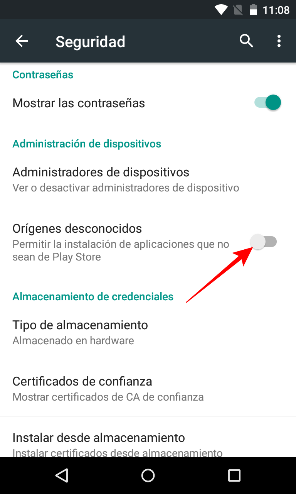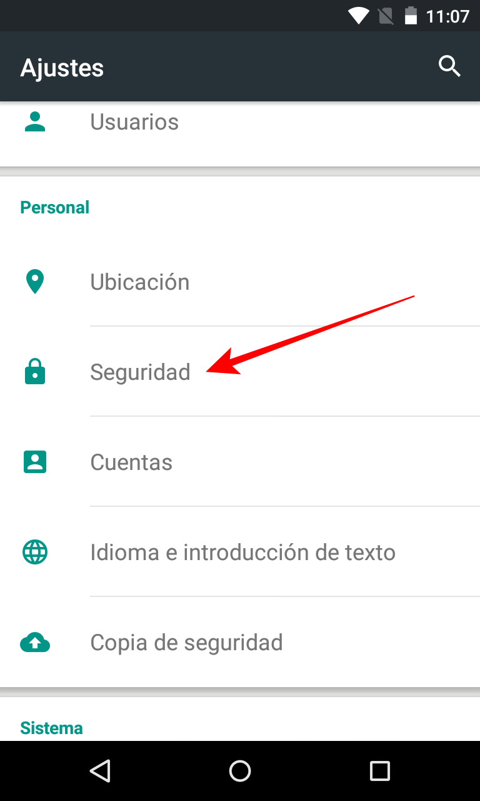
> 
> Figura AP-1. Opciones de seguridad Figura AP-2. Orígenes desconocidos

6.  Se descarga el archivo y automáticamente el dispositivo inicia el
    proceso de instalación (Figura AP-3 y Figura AP-4). Se debe pulsar
    *instalar* para continuar.

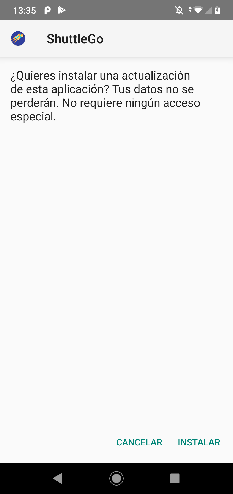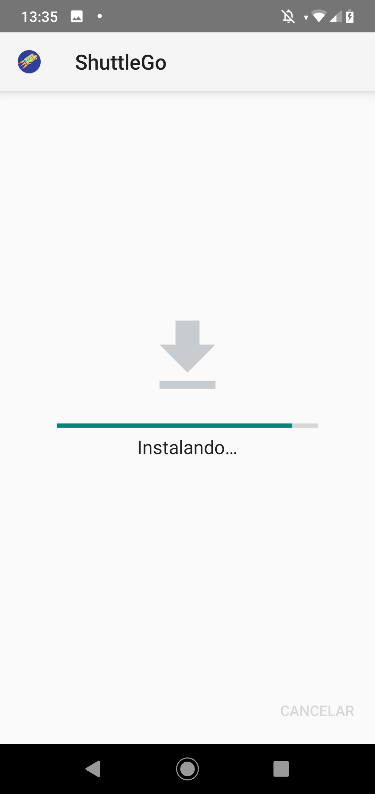

> Figura AP-3. Instalación APK Figura AP-4. Instalando APK

7.  Una vez completada la instalación, se debe pulsar *abrir* para
    ejecutar la aplicación (Figura AP-5).

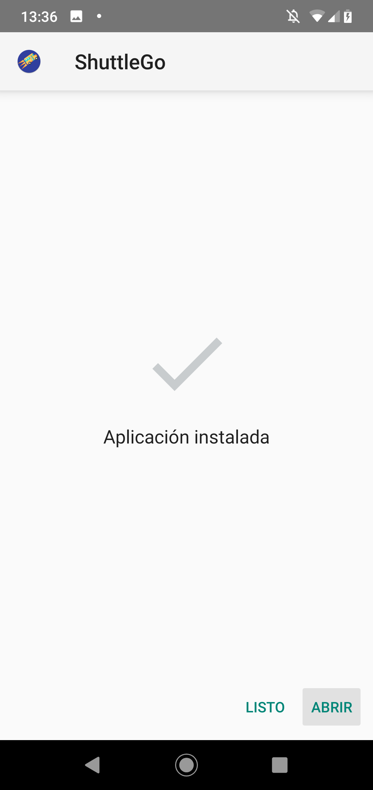

Figura AP-5. Instalación finalizada

## Apéndice 2: Manual de usuario

Este manual proporciona los detalles necesarios para el uso de la
aplicación móvil ShuttleGo, con la finalidad de brindar al usuario una
herramienta que asegure el uso correcto de la aplicación.

En la aplicación se pueden adoptar varios roles, por lo que se explicará
en secciones separadas cada una de las funcionalidades de dichos roles y
cómo poder acceder a cada uno de ellos.

#### Inicio de sesión.

> La primera interfaz que se muestra para interactuar con la aplicación
> es la de inicio de sesión. En dicha interfaz cabe la posibilidad de
> introducir las credenciales en los campos *email* y *contraseña* que
> aparecen en el centro de la pantalla o bien pulsar sobre el botón
> *regístrate* que está situado debajo del botón *iniciar sesión*
> (Figura AP-6).
> 
> 

Figura AP-6. Inicio de sesión

> Si se elige la primera opción, el requisito previo es que el usuario
> ya posea una cuenta de usuario, de ser así, se introduce el email y
> contraseña en sus respectivos editores de texto y se pulsa sobre el
> botón *iniciar sesión*; si las credenciales han sido introducidas
> correctamente, se accede de forma directa a la aplicación, en caso
> contrario, se mostrará un mensaje de error tras el cual, se deben
> modificar los datos introducidos anteriormente hasta que sean
> correctos.
> 
> Si aún no se dispone de una cuenta de usuario se debe pulsar sobre el
> botón *regístrate,* que automáticamente redirigirá al registro de la
> aplicación.

#### Registro.

> El registro de la aplicación consta de dos fases, en cada una de las
> cuales se introduce un tipo de información diferente para poder
> finalizar el registro con éxito. En la primera fase (Figura AP-7) se
> especifican el correo, la contraseña y el rol que adoptará el usuario.
> Una vez que los campos están completados, se continúa pulsando sobre
> el botón *siguiente*. La segunda y última fase (Figura AP-8), es la
> referente a los datos personales, en la que únicamente se debe
> introducir el nombre, apellido/s y el número de teléfono del usuario.

Figura AP-7. Registro 1 Figura AP-8. Registro 2

> Una vez realizados los pasos anteriores se puede concluir el proceso
> de registro pulsando sobre el botón *finalizar* que aparece en la
> parte inferior de la interfaz. Si los datos introducidos son
> correctos, se accede de forma directa a la aplicación, en caso
> contrario se mostrará un mensaje de error especificando el problema,
> tras el que se deben modificar los datos que sean erróneos y proceder
> a la verificación del registro nuevamente.

3.  #### Roles
    
    1.  ##### Administrador.

El rol de administrador adopta un papel fundamental dentro de la
aplicación, ya que es el encargado de establecer los puntos de origen
desde los cuales los conductores y pasajeros elegirán comenzar su
trayecto.

El rol de administrador no está disponible para el usuario de la
aplicación, por esta razón, es una opción que no aparece en el registro.
Para acceder desde el inicio de sesión a este módulo de la aplicación,
se deben introducir unas credenciales previamente establecidas:

  - Email de usuario: *<admin@gmail.com>*

  - Contraseña: *123*

La interfaz principal del administrador consta de dos partes: la primera
contiene un mapa y una barra de búsqueda desde la que se introduce la
reseña del punto de origen que se desea establecer. La segunda parte de
la interfaz está compuesta por un editor de texto en el que se introduce
el nombre que se quiere dar al origen (Figura AP-9).

Figura AP-9 . Interfaz administrador Figura AP-10. Interfaz origen

Una vez realizados los pasos anteriores se puede finalizar el proceso
pulsando sobre el botón *añadir.* Si el origen ha sido añadido
correctamente se redirige a la interfaz principal del mismo (Figura
AP-10), en la que se pueden realizar dos operaciones: pulsar sobre el
botón *eliminar*, el cual borrará automáticamente el origen, o bien
pulsar sobre el botón *editar* que redirigirá a la interfaz de edición
del origen (Figura AP-11)*,* desde la cual se puede modificar su nombre
(Figura AP-12).

Es posible retornar a la interfaz principal haciendo uso del botón
*back* del dispositivo móvil (también desde cualquier interfaz del
módulo de administrador, así como del resto de la aplicación). Se puede
acceder al menú de opciones del módulo administrador de dos formas
diferentes: pulsando sobre el icono situado en la parte superior derecha
de la interfaz, o bien, deslizando el dedo desde la parte izquierda de
la pantalla hacia la parte derecha (Figura AP-13). Dicho menú consta de
dos opciones principales: el botón de *inicio*, el cual redirigirá a la
interfaz principal del módulo y el botón *orígenes,* que permite acceder
a un listado de todos los orígenes disponibles, con la posibilidad de
pulsar sobre cualquiera de ellos y acceder a las funcionalidades de
origen anteriormente descritas (Figura AP-14).

Figura AP-11 . Editar origen Figura AP-12. Origen editado

##### 

Figura AP-13 . Menú administrador Figura AP-14 . Listado de orígenes

##### Conductor.

El rol de conductor es el encargado de crear nuevos trayectos para que
los pasajeros puedan contratarlos.

Figura AP-15 . Interfaz conductor Figura AP-16. Interfaz ruta conductor

La interfaz principal de conductor (Figura AP-15) consta de un
formulario en el que se deben introducir los datos correspondientes al
trayecto que se desea realizar. Dichos datos son: el punto de origen
preestablecido por el administrador, el código postal del distrito en el
cual se quiere dar servicio a los pasajeros, la capacidad de personas
máximas que puede llevar en el vehículo y la hora de salida desde el
punto de partida. Una vez introducidos todos los datos se puede
finalizar el proceso pulsando sobre el botón *crear trayecto*, tras lo
cual y siempre y cuando los datos introducidos sean correctos (de lo
contrario se notificará con un mensaje de aviso) se habrá concluido el
proceso de creación de un trayecto.

Cuando se crea un nuevo trayecto la aplicación redirige a la interfaz
principal del mismo (Figura AP-16) desde la cual se muestra la
información del trayecto así como las diferentes opciones que se pueden
realizar: un botón que permitirá *eliminar* el trayecto (siempre y
cuando dicho trayecto no contenga personas adjuntadas a él) y la opción
*comenzar trayecto*. Esta última opción solamente es accesible si el
número de pasajeros que ha contratado el trayecto es al menos uno. Si
se cumple el requisito anterior, y se pulsa sobre dicho botón, la
aplicación colocará los puntos por los que el conductor tendrá que
realizar el trayecto (Figura AP-17) y calculará la ruta más óptima para
llegar hasta ellos; tras este proceso se renderizará un mapa con la ruta
pintada sobre él (Figura AP-18) y nos dará la opción de *comenzar* el
trayecto.

Figura AP-17. Calculando ruta Figura AP-18. Comenzar ruta

Al igual que en el resto de la aplicación es posible volver hacia atrás
pulsando los botones *back* del dispositivo móvil, permitiendo así
regresar a la interfaz principal. Se puede acceder al menú de opciones
(Figura AP-19) pulsando sobre el icono situado en la parte superior
derecha de la interfaz o bien deslizando el dedo sobre la pantalla desde
el lado izquierdo hacia el derecho. De esta forma se despliega el menú
dando lugar a varias opciones: el botón de *inicio*, que a la aplicación
en la interfaz principal del conductor y el botón *rutas* que permite
acceder a un listado (Figura AP-20) de los trayecto disponibles que
tiene el conductor en ese momento. En dicho listado es posible pulsar
sobre cualquiera de los trayectos accediendo de esta forma a las
diferentes opciones de ruta citadas anteriormente.

Figura AP-19. Menú conductor Figura AP-20. Listado rutas

##### Pasajero.

El rol de pasajero es el encargado de contratar los viajes publicados
por el conductor.

La interfaz principal de pasajero consiste en un mapa que muestra la
geolocalización del usuario y por el cual es posible navegar. En la
parte superior de dicho mapa, hay dos barras de búsqueda en las que el
pasajero debe introducir un punto de origen (ya preestablecido) y el
punto de destino al que desea dirigirse. Una vez completados ambos pasos
(Figura AP-21), se puede dar comienzo a la contratación del trayecto
pulsando sobre el botón *buscar trayecto*, tras lo cual se mostrará una
lista con las diferentes rutas disponibles según los datos anteriormente
introducidos (Figura AP-22).

Figura AP-21. Interfaz pasajero Figura AP-22. Listado de viajes
disponibles

Figura AP-23. Información ruta Figura AP-24. Menú pasajero

Una vez que se ha elegido el trayecto deseado, se redirige a la interfaz
de trayecto en la que se muestran los detalles del mismo y se encuentra
la opción de contratar el viaje pulsando sobre el botón *añadir* (Figura
AP-23).

Se puede acceder al menú de opciones (Figura AP-24) pulsando sobre el
botón superior derecho de la interfaz o deslizando el dedo sobre la
pantalla desde la parte izquierda de la misma hacia la parte derecha. Si
se pulsa sobre el botón *inicio* se accede a la interfaz principal de
pasajero, en caso contrario, si la opción elegida es *rutas,* se accede
a un listado de las rutas contratadas por el pasajero (Figura AP-26). Al
pulsar sobre un trayecto de la lista, automáticamente se muestra la
información de dicho trayecto junto con la posibilidad de *cancelar
ruta* (Figura AP-26).

Figura AP-25.- Listado rutas pasajero Figura AP-26. Interfaz ruta
pasajero

Bibliografía

  - ##### \[1\] [Infraestructura del transporte - Cátedra Abertis](http://www.catedrasabertis.com/)

  - ##### \[2\] [¿Cómo funciona Uber? - Uber](https://www.uber.com/es-ES/about/how-does-uber-work/)

  - ##### \[3\] [Compromiso de Cabify - Cabify](https://cabify.com/es/safety)

  - ##### \[4\] [BlaBlaCar](https://www.blablacar.es/)

  - ##### \[5\] [CarSharing en España - Car2Go](https://www.car2go.com/ES/es/)

  - ##### \[6\] [MyTaxi](http://mytaxi.com)

  - ##### \[7\] [Transporte Madrid - EMT Interurbanos Metro TTP](https://play.google.com/store/apps/details?id=com.jsvmsoft.interurbanos)

  - ##### \[8\] [Conoce Android Studio - Android Developers](https://developer.android.com/studio/intro/?hl=ES)

  - ##### \[9\] [¿Qué es Firebase y qué nos aporta? - Arpent Technologies](https://arpentechnologies.com/es/blog/aplicaciones-movil/que-es-firebase-y-que-nos-aporta/)

  - ##### \[10\] [Mapbox - Genbeta](https://www.genbeta.com/desarrollo/mapbox-el-sdk-de-mapas-abierto)

  - ##### \[11\] [Instalar APK en Android - Xataka Android](https://www.xataka.com/basics/instalar-apk-en-android-como-hacerlo-y-cuales-son-los-riesgos)
